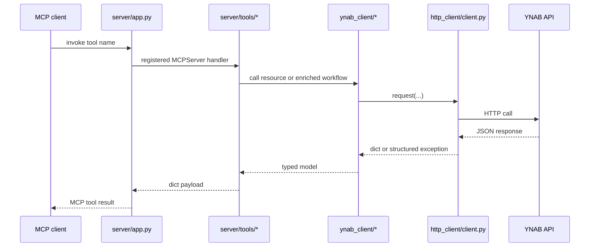

# AGENTS.md

This file tells AI agents and contributors how this repository works and how to extend it correctly.

## What this document is for

Read this page if you need:
- implementation rules
- extension paths for raw or enriched tools
- architecture invariants that docs must match
- guidance for updating diagrams and repo docs

Adjacent docs:
- [README.md](README.md)
- [Architecture](docs/architecture.md)
- [Repo Structure](docs/repo-structure.md)
- [Tool Surface](docs/tool-surface.md)
- [Testing](docs/testing.md)

## Mission

`mcp-server-for-ynab` is an MCP server for AI agents to interact with YNAB budgets. It exposes the YNAB API through raw tools and adds enriched AI-friendly helpers on top. The goal is safe, explicit budget management rather than autonomous financial decision-making.

## Start Here If You Are Modifying the Repo

1. Read [Architecture](docs/architecture.md).
2. Read [Repo Structure](docs/repo-structure.md).
3. Read [Tool Surface](docs/tool-surface.md) if you are touching tools.
4. Read [Testing](docs/testing.md) before changing behavior.
5. Update docs and diagrams when the structure or request flow changes.

## Architecture Map

```text
src/mcp_server_for_ynab/
├── auth/         auth abstraction + PAT implementation
├── cli/          stdio/http entrypoints and smoke helper
├── config/       env loading, runtime validation, default plan resolution
├── enriched/     AI-friendly read workflows
├── http_client/  async httpx wrapper: retries, error normalization, redaction
├── models/       typed YNAB shapes, shared error model, milliunit helpers
├── server/       MCPServer app, context, registry, error boundary, tool registration
└── ynab_client/  async wrappers for YNAB resource families
```

## Trace a Tool from MCP Name to YNAB Request



If you need to follow a tool:
- start in `src/mcp_server_for_ynab/server/tools/`
- find the corresponding `ynab_client` resource wrapper
- then trace through `http_client/client.py`

## Tool Conventions

### Classification

Every tool is one of:
- `read`
- `write`

Enriched tools should stay read-only unless there is a very strong reason
otherwise. Three exist: `months_assign_many` and `money_move` in
`server/tools/writes.py`, and `reconcile_apply` in `server/tools/reconcile.py`.
Each composes raw writes because YNAB's unit of work — one category, one month,
one absolute amount; one transaction, one field — is not the unit of the
decision, and each journals the whole composition as a single entry so one
decision reverts as one decision. A composed write must:

- be named and described so the caller knows exactly what it will change
- record every before-state it touched in one journal entry
- report what was applied and what failed, since YNAB has no transaction
  boundary
- journal what it did even when it fails part-way, because that is precisely
  when a revert is needed
- have a revert strategy that undoes everything in the entry together.
  `reconcile_apply` is the case that makes this concrete: it restores cleared
  statuses *and* deletes the adjustment transaction, because undoing one without
  the other leaves the account wrong by the amount that was in dispute

### Naming

Raw tools:
- `<resource>_<action>`

Enriched tools:
- `<family>_<intent>`

### Metadata

Every registered tool carries:
- `family`
- `classification`
- `tool_type`
- `summary`
- optional `priority`

Keep metadata accurate. `overview_available_tools` depends on it.

## Request Budget Rule

YNAB allows 200 requests per hour per token and the quota is shared with the
user's own YNAB apps, so the limit — not payload size — is what ends a long
working session. Two consequences bind every change here:

- **A tool says what it costs.** Anything spanning months costs one request per
  month; anything batched says whether the cost scales with the batch. The cost
  belongs in the description, where it is read before the call, not discovered
  from a 429 after 240 items.
- **Cost that scales with the batch is a bug to fix, not a fact to document.**
  `transactions_bulk_update` writes in one PATCH, and its before-state capture
  used to be one GET per transaction — the expensive half, invisible in both the
  description and the response. `history/capture.py:before_transactions` reads
  the batch in a single list call instead, and falls back to individual reads
  only for the handful of ids a register does not hold.

`server/tools/boundary.py` attaches `requests_used_this_hour` and
`requests_remaining` to every response, success or failure. Do not remove that:
an agent paces itself against a number it can see and will not spend a call to
ask for one. `ping` must stay free of YNAB calls for the same reason — it is
what an agent uses to check liveness while waiting out a rate limit.

## Payload Size Rule

Payload size is a correctness constraint, not an optimization. One uncompacted
`months_get` on a real plan is about 60 KB, so a twenty-one-month review is not
merely expensive — it does not fit, and the reviewer ends up parsing files off
disk instead of reading a budget.

Therefore:

- any tool returning a list of categories offers `compact=true`, projecting
  through `enriched/multi_month.py:compact_category`
- hidden and deleted categories are excluded by default, and the response says
  how many were omitted rather than dropping them silently
- anything spanning months goes through `enriched/multi_month.py`, which owns
  month normalisation, the 36-month cap, and the concurrency limit
- a tool whose cost scales with the range says so in its description, because
  YNAB has no range endpoint and one month is one request
- a list read offers `fields` and drops null and empty members, through
  `server/tools/projection.py`. Say in the response that empties were dropped:
  a missing `category_id` means uncategorized, and a reader who does not know
  the rule cannot tell that from a withheld field
- a write echoes ids and counts, not records. The full records go behind
  `return_transactions=true`: eighty of them is about 70 KB, past what a client
  will hold, and the caller then parses `applied_count` off disk

Hidden is not a display preference. YNAB keeps each credit card's payment
category in a hidden group, so `include_hidden` is the difference between
seeing card funding and not.

## Queue Rule

A triage queue is only useful if everything in it is work. Anything that cannot
be acted on — a transaction on an off-budget tracking account, a transfer
between two on-budget accounts — is excluded by default, and the response
reports both the actionable count and what the raw filter said. Adding a queue
means deciding what does not belong in it.

## Milliunit Rule

YNAB amounts are always milliunits.

- `1000 = $1.00`
- raw tools accept and return milliunits for canonical amount fields
- enriched tools may add display helpers, but canonical values stay milliunits
- any future dollar-input convenience must be explicit and route through `models.amounts`

If a tool touches money, say so in the tool description.

## Say What the API Cannot Do

Some limits are YNAB's, and an agent that does not know them reports success the
user can disprove in ten seconds:

- there is no route that sets an account's `last_reconciled_at`, so marking
  transactions reconciled leaves the app showing the old date
- the rate-limit quota belongs to the token and is shared with the user's own
  YNAB apps, so a window does not fully reopen on the hour
- delta sync reports that a record changed, not how

Where a tool touches one of these, the limit belongs in its description *and* in
the response that could otherwise mislead. `enriched/reconcile.py` carries the
pattern: one constant, stated in every payload that reports success.

## Shared Error Shape

All tool failures should use the shared error contract from `models/errors.py`.

Top-level fields:
- `error_type`
- `message`
- optional `status_code`
- optional `retry_after`
- optional `retry_at`, the same deadline as a wall-clock instant, because a
  scheduler that converts seconds into a wake-up time drifts by however long it
  took to schedule
- optional `details`
- optional `ynab_error_name`
- optional `ynab_error_id`

At the MCP boundary, `server/tools/boundary.py` is responsible for converting known exceptions into the shared shape.

## Default Plan Behavior

If `YNAB_PLAN_ID` is set:
- tools that accept `plan_id` may default to it

If no explicit or default plan ID is available:
- the call should fail in a validation-style way through the shared tool boundary

## Transfer and Subtransaction Rules

Transfer transactions are paired:
- do not treat them as ordinary spending
- document transfer implications for raw mutation tools

Split transactions use `subtransactions`:
- raw transaction models should include them
- enriched tools must not lose or misinterpret them

## Delta Sync

Where YNAB supports it:
- accept `last_knowledge_of_server`
- return `server_knowledge`

Do not remove delta-sync capability from raw tools when modifying route wrappers.

The counter is plan-wide, not per-route, which is why `changes_since` can pass
one value to three list routes and return the highest as the value to carry
forward.

## Mutation Safety

- Raw write tools mutate only when explicitly called.
- No tool ever performs a write the caller did not ask for by name.
- Write tool descriptions should clearly indicate side effects.
- The journal sentence on each write description is derived in
  `server/tools/presentation.py`, not written on the decorator. If you add a
  write whose revert story differs from the existing three cases — reversible,
  recreated with a new id, permanent — extend that derivation rather than
  hand-writing the sentence.

## How to Add a Raw Tool

1. Add or update types under `models/ynab/` if needed.
2. Add the async wrapper in `ynab_client/<resource>.py`.
3. Register the tool in `server/tools/raw/`.
4. Ensure it is wrapped by the tool boundary.
5. Add contract tests.
6. Add integration tests if MCP-boundary behavior matters.
7. Update docs if the tool family or semantics changed.

## How to Add an Enriched Tool

1. Define the user or agent question it answers.
2. Implement it in `enriched/`.
3. Register it in `server/tools/enriched.py`.
4. Keep it read-only unless there is a deliberate design change.
5. Reuse raw client semantics rather than duplicating route logic.
6. Add tests.
7. Update [Tool Surface](docs/tool-surface.md) if the surface area changes.

## How to Validate a Documentation Change

After changing docs:
- read `README.md` as a new contributor
- confirm package/file references actually exist
- confirm Mermaid diagrams still describe the current code
- run the existing repo checks if the change touched code or commands

If the doc change affects examples or commands:
- ensure those examples still match `Makefile`, CLI, and current config

## Mermaid Guidance

Use Mermaid for:
- architecture diagrams
- request flow diagrams
- tool family maps
- documentation maps

Prefer:
- `flowchart`
- `sequenceDiagram`
- `mindmap`

Rules:
- keep labels short
- prefer structural diagrams over decorative ones
- diagrams must render in GitHub markdown
- update diagrams when package layout, request flow, or tool families change

## When to Update Diagrams

Update the affected Mermaid diagrams whenever you change:
- package boundaries
- server wiring
- request flow
- tool registration model
- test layering
- documentation navigation structure

## Known Documentation Invariants

- `docs/architecture.md` must match the actual package layout.
- `README.md` examples must remain runnable.
- Mermaid diagrams must reflect current request flow and structure.
- `docs/testing.md` must not overclaim test coverage.
- `docs/repo-structure.md` must match the actual repo tree.

## SDK Rule

The MCP framework is `MCPServer` from the official `mcp` package, imported from
`mcp.server.mcpserver`. This is not the standalone `fastmcp` package on PyPI,
and it is not the `mcp.server.fastmcp` path — that was the v1 name and the
module was removed in mcp 2.0.

Two consequences worth knowing before touching the server layer:

- `ToolAnnotations` fields are snake_case in Python (`read_only_hint`) and
  camelCase on the wire (`readOnlyHint`). Clients see the protocol spelling;
  only the Python attribute names changed.
- `server/tools/presentation.py` and `cli/smoke.py` reach into
  `_tool_manager._tools`, which is private and has survived one major version.
  If a future SDK moves it, presentation degrades quietly by design rather than
  failing startup — keep it that way.

## Async Rule

The stack is `asyncio`-based end to end.

Do not introduce:
- sync HTTP wrappers
- duplicated sync entry paths
- blocking network logic in tool handlers

## Evals

`evals/` holds agent evals: cases that check an assistant *uses* the server
correctly, rather than that the server works. They exist because the two failures
this project has actually suffered — an hour lost to a loop that should have
been one call, and an account reported as reconciled that YNAB still showed as
stale — are invisible to every test in `tests/`.

They are graded by a model, so they are slow, cost money, and are not part of
`make check`. Run them with `claude plugin eval` on demand.

When a change's whole point is that an agent should behave differently — a cost
stated in a description, a cheaper option offered, a caveat carried on a
response — add or update a case. A description nothing measures is a hope. See
`evals/README.md` for what makes a case worth adding, and note that no case has
been run yet: the criteria are reviewed intent rather than observed results.

## Releasing

Two rules here are load-bearing, and neither is guessable from the code.

**The release notes are the tag's annotation.** `release.yml` creates the GitHub
release with `--notes-from-tag`: the tag's subject line becomes the title and the
rest of its message becomes the notes. A lightweight tag publishes a version
whose release page is empty, and there is no second place to put that text. Write
the notes first, then `git tag -a vx.y.z -F notes.md`. The workflow refuses an
unannotated tag before it publishes anything, because a tag can be moved and a
PyPI version cannot — PyPI allows a yank, never a replacement.

**The version lives in `pyproject.toml` and nowhere else you may edit.**
`scripts/sync_packaging.py`, via `make packaging-sync`, generates the five
manifests that repeat it. The workflow refuses a tag that disagrees with
`pyproject.toml`.

The publish then waits on the `pypi` environment for a human. That gate is why a
tagged version is not a released one: a run has sat waiting for days while every
manifest pinned a version PyPI did not have, which is a one-click install that
cannot resolve. Before assuming a version shipped, check
`gh run list --workflow=release.yml`.

Full sequence, including the live read sweep that runs before tagging:
[Distribution](docs/distribution.md#cutting-a-release).

## Quality Gate

A change is not done unless:
- docs are updated when structure or behavior changes
- tool descriptions match behavior
- milliunit handling remains consistent
- shared error-shape behavior remains intact
- tests remain green
- diagrams remain truthful
