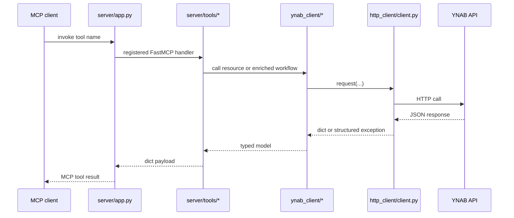

# AGENTS.md

This file tells AI agents and contributors how this repository works and how to extend it correctly.

## What this document is for

Read this page if you need:
- implementation rules
- extension paths for raw or enriched tools
- architecture invariants that docs must match
- guidance for updating diagrams and repo docs

Adjacent docs:
- [README.md](README.md)
- [Architecture](docs/architecture.md)
- [Repo Structure](docs/repo-structure.md)
- [Tool Surface](docs/tool-surface.md)
- [Testing](docs/testing.md)

## Mission

`ynab-mcp` is an MCP server for AI agents to interact with YNAB budgets. It exposes the YNAB API through raw tools and adds enriched AI-friendly helpers on top. The goal is safe, explicit budget management rather than autonomous financial decision-making.

## Start Here If You Are Modifying the Repo

1. Read [Architecture](docs/architecture.md).
2. Read [Repo Structure](docs/repo-structure.md).
3. Read [Tool Surface](docs/tool-surface.md) if you are touching tools.
4. Read [Testing](docs/testing.md) before changing behavior.
5. Update docs and diagrams when the structure or request flow changes.

## Architecture Map

```text
src/ynab_mcp/
├── auth/         auth abstraction + PAT implementation
├── cli/          stdio/http entrypoints and smoke helper
├── config/       env loading, runtime validation, default plan resolution
├── enriched/     AI-friendly read workflows
├── http_client/  async httpx wrapper: retries, error normalization, redaction
├── models/       typed YNAB shapes, shared error model, milliunit helpers
├── server/       FastMCP app, context, registry, error boundary, tool registration
└── ynab_client/  async wrappers for YNAB resource families
```

## Trace a Tool from MCP Name to YNAB Request



If you need to follow a tool:
- start in `src/ynab_mcp/server/tools/`
- find the corresponding `ynab_client` resource wrapper
- then trace through `http_client/client.py`

## Tool Conventions

### Classification

Every tool is one of:
- `read`
- `write`

Enriched tools should stay read-only unless there is a very strong reason otherwise.

### Naming

Raw tools:
- `<resource>_<action>`

Enriched tools:
- `<family>_<intent>`

### Metadata

Every registered tool carries:
- `family`
- `classification`
- `tool_type`
- `summary`
- optional `priority`

Keep metadata accurate. `overview_available_tools` depends on it.

## Milliunit Rule

YNAB amounts are always milliunits.

- `1000 = $1.00`
- raw tools accept and return milliunits for canonical amount fields
- enriched tools may add display helpers, but canonical values stay milliunits
- any future dollar-input convenience must be explicit and route through `models.amounts`

If a tool touches money, say so in the tool description.

## Shared Error Shape

All tool failures should use the shared error contract from `models/errors.py`.

Top-level fields:
- `error_type`
- `message`
- optional `status_code`
- optional `retry_after`
- optional `details`
- optional `ynab_error_name`
- optional `ynab_error_id`

At the MCP boundary, `server/tools/boundary.py` is responsible for converting known exceptions into the shared shape.

## Default Plan Behavior

If `YNAB_PLAN_ID` is set:
- tools that accept `plan_id` may default to it

If no explicit or default plan ID is available:
- the call should fail in a validation-style way through the shared tool boundary

## Transfer and Subtransaction Rules

Transfer transactions are paired:
- do not treat them as ordinary spending
- document transfer implications for raw mutation tools

Split transactions use `subtransactions`:
- raw transaction models should include them
- enriched tools must not lose or misinterpret them

## Delta Sync

Where YNAB supports it:
- accept `last_knowledge_of_server`
- return `server_knowledge`

Do not remove delta-sync capability from raw tools when modifying route wrappers.

## Mutation Safety

- Raw write tools mutate only when explicitly called.
- Enriched tools never perform hidden writes.
- Write tool descriptions should clearly indicate side effects.

## How to Add a Raw Tool

1. Add or update types under `models/ynab/` if needed.
2. Add the async wrapper in `ynab_client/<resource>.py`.
3. Register the tool in `server/tools/raw/`.
4. Ensure it is wrapped by the tool boundary.
5. Add contract tests.
6. Add integration tests if MCP-boundary behavior matters.
7. Update docs if the tool family or semantics changed.

## How to Add an Enriched Tool

1. Define the user or agent question it answers.
2. Implement it in `enriched/`.
3. Register it in `server/tools/enriched.py`.
4. Keep it read-only unless there is a deliberate design change.
5. Reuse raw client semantics rather than duplicating route logic.
6. Add tests.
7. Update [Tool Surface](docs/tool-surface.md) if the surface area changes.

## How to Validate a Documentation Change

After changing docs:
- read `README.md` as a new contributor
- confirm package/file references actually exist
- confirm Mermaid diagrams still describe the current code
- run the existing repo checks if the change touched code or commands

If the doc change affects examples or commands:
- ensure those examples still match `Makefile`, CLI, and current config

## Mermaid Guidance

Use Mermaid for:
- architecture diagrams
- request flow diagrams
- tool family maps
- documentation maps

Prefer:
- `flowchart`
- `sequenceDiagram`
- `mindmap`

Rules:
- keep labels short
- prefer structural diagrams over decorative ones
- diagrams must render in GitHub markdown
- update diagrams when package layout, request flow, or tool families change

## When to Update Diagrams

Update the affected Mermaid diagrams whenever you change:
- package boundaries
- server wiring
- request flow
- tool registration model
- test layering
- documentation navigation structure

## Known Documentation Invariants

- `docs/architecture.md` must match the actual package layout.
- `README.md` examples must remain runnable.
- Mermaid diagrams must reflect current request flow and structure.
- `docs/testing.md` must not overclaim test coverage.
- `docs/repo-structure.md` must match the actual repo tree.

## Async Rule

The stack is `asyncio`-based end to end.

Do not introduce:
- sync HTTP wrappers
- duplicated sync entry paths
- blocking network logic in tool handlers

## Quality Gate

A change is not done unless:
- docs are updated when structure or behavior changes
- tool descriptions match behavior
- milliunit handling remains consistent
- shared error-shape behavior remains intact
- tests remain green
- diagrams remain truthful
