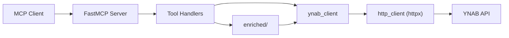

# MCP Server for YNAB

[](https://pypi.org/project/mcp-server-for-ynab/)
[](https://pypi.org/project/mcp-server-for-ynab/)
[](https://github.com/hs737/mcp-server-for-ynab/actions/workflows/ci.yml)
[](LICENSE)

An AI-first [Model Context Protocol](https://modelcontextprotocol.io/) server for
[YNAB](https://ynab.com). It exposes the YNAB API as MCP tools, then adds
enriched tools that answer questions the raw API cannot answer in one call —
budget health, cleanup queues, spending analysis.

**Read-only by default.** Write tools are not registered unless you set
`YNAB_ALLOW_WRITES=1`, so an agent cannot change your budget until you say so.
See [Write Tools](#write-tools).

## Quick Start

### 1. Get a YNAB token

Generate a personal access token at
[app.ynab.com/settings/developer](https://app.ynab.com/settings/developer).

You also need [`uv`](https://docs.astral.sh/uv/), which provides `uvx`:

```bash
curl -LsSf https://astral.sh/uv/install.sh | sh   # macOS and Linux
brew install uv                                   # macOS with Homebrew
winget install --id=astral-sh.uv -e               # Windows
```

Check both work. Nothing to clone — `uvx` fetches the package and runs it in a
throwaway environment:

```bash
YNAB_API_KEY=your_token uvx mcp-server-for-ynab smoke
```

`smoke` validates configuration and tool registration, then exits. It should
print `smoke: app created, 44 tools registered`.

### 2. Add it to your client

| Client | Setup |
|--------|-------|
| [Claude Code](https://claude.com/product/claude-code) | [one command](docs/client-setup.md#claude-code) |
| [Claude Desktop](https://claude.ai/download) | [config file](docs/client-setup.md#claude-desktop) |
| [Cursor](https://cursor.com) | [one-click link](docs/client-setup.md#cursor) |
| [VS Code](https://code.visualstudio.com) (GitHub Copilot) | [one command](docs/client-setup.md#vs-code) |
| [Codex CLI](https://developers.openai.com/codex) | [one command](docs/client-setup.md#codex-cli) |
| [Gemini CLI](https://github.com/google-gemini/gemini-cli) | [one command](docs/client-setup.md#gemini-cli) |
| [Windsurf](https://windsurf.com), [Zed](https://zed.dev), others | [generic stdio config](docs/client-setup.md#other-stdio-clients) |
| [MCP Inspector](https://github.com/modelcontextprotocol/inspector) | [debugging](docs/client-setup.md#mcp-inspector) |

The two most common paths:

**Claude Code** — install the plugin, which brings its own MCP config:

```bash
/plugin marketplace add hs737/mcp-server-for-ynab
/plugin install mcp-server-for-ynab@mcp-server-for-ynab
```

Or register the server directly, if you would rather not use a plugin:

```bash
claude mcp add --env YNAB_API_KEY=your_ynab_token --transport stdio --scope user \
  ynab -- uvx mcp-server-for-ynab stdio
```

**Claude Desktop, Cursor, Windsurf, and most others** — paste into the client's
MCP config file:

```json
{
  "mcpServers": {
    "ynab": {
      "command": "uvx",
      "args": ["mcp-server-for-ynab", "stdio"],
      "env": {
        "YNAB_API_KEY": "your_ynab_token",
        "YNAB_PLAN_ID": "your_plan_id"
      }
    }
  }
}
```

`YNAB_PLAN_ID` is optional but recommended — with it set, you never have to
name a budget in a request. Full per-client instructions, including where each
config file lives and how to keep the token out of it, are in
[Client Setup](docs/client-setup.md).

**Desktop hosts that accept bundles** — download
[`mcp-server-for-ynab-0.1.0.mcpb`](https://github.com/hs737/mcp-server-for-ynab/releases/latest)
and open it. The host asks for your token in a form and stores it in your OS
keychain, so there is no config file to edit and no token sitting in plain text.
A checkbox controls whether writes are enabled.

### Docker

The server speaks MCP over stdin and stdout, so run it attached with `-i`.
There is no port to publish:

```bash
docker build -t mcp-server-for-ynab .
docker run -i --rm -e YNAB_API_KEY=your_ynab_token mcp-server-for-ynab
```

If you enable writes, mount a volume for the history — otherwise `--rm` discards
the record that makes a revert possible:

```bash
docker run -i --rm -e YNAB_API_KEY=your_ynab_token -e YNAB_ALLOW_WRITES=1 \
  -v ynab-mcp-history:/home/app/.mcp-server-for-ynab mcp-server-for-ynab
```

### 3. Ask it something

> What's my cash position across all accounts?

If that works, you're set. If it doesn't, see
[Troubleshooting](docs/client-setup.md#troubleshooting) — the usual cause is
that the client cannot find `uvx` on its `PATH`.

## What You Can Ask

Read-only, works out of the box:

| Ask | Tool it reaches for |
|-----|---------------------|
| "How is this month's budget doing?" | `overview_month_health` |
| "What's my cash position across all accounts?" | `overview_cash_position` |
| "Which transactions still need a category?" | `triage_uncategorized` |
| "What's waiting for me to approve?" | `triage_unapproved` |
| "Which categories are overspent, and by how much?" | `analysis_overspent_categories` |
| "Which targets won't be funded this month?" | `analysis_target_funding_gaps` |
| "Are any scheduled transactions at risk?" | `analysis_upcoming_scheduled_risks` |
| "What have I spent at this payee over the last year?" | `bookkeeping_transaction_history` |
| "What subscriptions am I actually paying for?" | `analysis_recurring_charges` |

With `YNAB_ALLOW_WRITES=1`:

> Categorize last week's uncategorized transactions, then show me what you changed.

The agent categorizes, and `history_list` shows every write with the value that
preceded it. `history_revert` undoes any of them.

Agents work best when they start with `overview_available_tools`, which returns
the current tool catalog grouped by family. See
[Tool Surface](docs/tool-surface.md) for the full map.

### Guided workflows

Six prompts ship with the server, and most clients surface them as slash
commands — a starting point that does not require reading the tool list first:
monthly review, weekly triage, categorize and approve, subscription audit, cash
position, and review-and-undo.

Three resources (`ynab://guide/*`) carry the YNAB method, the write-safety
rules, and guidance on which tool to reach for. They are fetched on demand, so
they cost nothing until a client asks for them.

## Configuration

| Variable | Required | Description |
|----------|----------|-------------|
| `YNAB_API_KEY` | Yes | YNAB personal access token |
| `YNAB_PLAN_ID` | Recommended | Default plan ID, making `plan_id` optional on most tools |
| `YNAB_ALLOW_WRITES` | No | Register write tools. Unset means read-only |
| `YNAB_HISTORY_PATH` | No | Write history file, default `~/.mcp-server-for-ynab/history.jsonl` |
| `YNAB_RATE_LIMIT_PER_HOUR` | No | Client-side request budget, default `190` of YNAB's 200 |
| `YNAB_RATE_WARN_THRESHOLD` | No | Warn when this many requests remain, default `50` |
| `LOG_LEVEL` | No | Logging verbosity, default `INFO` |

Set these in your MCP client's `env` block. For local development, copy
`.env.example` to `.env` and fill it in.

### Rate limits

YNAB allows 200 requests per hour per token, and a single enriched tool can
spend several. The server tracks its own usage in a rolling hour and stops just
below YNAB's ceiling, so the limit you hit is local and clearly reported rather
than a 429 in the middle of a workflow. Call `overview_request_budget` to see
what is left; it costs no API requests.

## Tool Families

45 read-only tools, 64 with writes enabled, plus 6 guided prompts and 3 reference resources.

| Family | Type | Purpose |
|--------|------|---------|
| `overview` | enriched | Budget health snapshots and orientation |
| `triage` | enriched | Transaction cleanup queues |
| `bookkeeping` | enriched | Categorization suggestions, memo help, history |
| `analysis` | enriched | Spending analysis, funding gaps, scheduled risks |
| `history` | enriched | Review and roll back writes this server made |
| `user` | raw | YNAB user info |
| `plans` | raw | Plan and settings reads |
| `accounts` | raw | Account reads and creation |
| `categories` | raw | Categories and category groups |
| `months` | raw | Month-level budget data |
| `payees` | raw | Payee management |
| `payee_locations` | raw | Geographic payee metadata, niche/low-priority |
| `transactions` | raw | Transaction CRUD and import trigger |
| `scheduled_transactions` | raw | Scheduled transaction management |
| `money_movements` | raw | Money movement data |

**Raw tools** are close mirrors of YNAB endpoints — use them for exact reads and
all writes. **Enriched tools** combine several reads into one answer — use them
for orientation, investigation, and analysis. Every tool is labeled `read` or
`write`, and enriched tools perform no hidden writes.

More detail: [Tool Surface](docs/tool-surface.md)

## Write Tools

Write tools are **not registered unless you opt in**:

```bash
YNAB_ALLOW_WRITES=1
```

Without it the server is read-only, and the write tools are absent from
`tools/list` — an agent cannot call what it cannot see. This is deliberate: the
server holds a credential that can modify real financial records, and refusing a
call at execution time would still advertise the capability.

### Every write is recorded, and most can be undone

When writes are enabled, each one records the state that existed *before* it.
YNAB has no history endpoint, so this is the only way to get an overwritten
value back.

| Tool | Purpose |
|------|---------|
| `history_list` | Recent writes, newest first, each marked revertible or not |
| `history_show` | One entry in full, including the before state |
| `history_revert` | Undo one write |
| `history_revert_to` | Roll the plan back to its state at a chosen entry |

`history_revert_to` undoes everything after the entry you name, newest first,
because overlapping edits to the same record only compose correctly in reverse.
Reverting is itself recorded, so a revert can be reverted.

**What cannot be undone.** YNAB has no delete route for accounts, categories,
category groups, or payees, so creating one is permanent. Those operations are
recorded as non-revertible with the reason, and a rollback reports them under
`blocked` rather than skipping them silently — an incomplete rollback that
claims success is worse than one that tells you what it left behind. A
recreated transaction also gets a new id and loses any bank-import link.

### Writes are checked, not assumed

Tools that change a value re-read it afterwards and report a `verification`
block. A 200 response is not proof: YNAB accepts `budgeted` on the category
update route, returns 200, and ignores it. Verification is what catches that.

## Amount Convention

All YNAB monetary amounts are in **milliunits**: `1000 = $1.00`.

- Raw tools accept and return milliunits for canonical amount fields.
- Enriched tools may include display helpers alongside canonical values.

## Your Data

This server stores exactly one thing on your machine: a record of the writes it
made, used by `history_revert`. Nothing is sent anywhere except `api.ynab.com`,
and there is no telemetry.

```bash
uvx mcp-server-for-ynab history --show          # where it is, how much is there
uvx mcp-server-for-ynab history --export out.json
uvx mcp-server-for-ynab history --delete        # also removes the ability to revert
```

These need no credentials and no agent: getting your data back, or gone, should
not require running an LLM.

## For Contributors

This repo is structured so a contributor or AI agent can answer three questions
quickly: where the MCP server lives, where the YNAB API wrappers and models
live, and where to add new tools, tests, and docs.



The code is centered on a small set of layers:

- `src/mcp_server_for_ynab/server/`: FastMCP app, tool metadata, tool registration, error boundary
- `src/mcp_server_for_ynab/ynab_client/`: one async wrapper module per YNAB resource family
- `src/mcp_server_for_ynab/http_client/`: outbound `httpx` wrapper with retries, redaction, and error normalization
- `src/mcp_server_for_ynab/models/`: typed YNAB shapes, shared error model, milliunit helpers
- `src/mcp_server_for_ynab/enriched/`: higher-level read-only workflows built on top of raw clients
- `tests/`: unit, contract, integration, and QA/Postman source assets

Run it from a clone:

```bash
git clone https://github.com/hs737/mcp-server-for-ynab
cd mcp-server-for-ynab
uv sync
cp .env.example .env    # then set YNAB_API_KEY

make smoke-stdio
make run-stdio
make run-http
```

Run the tests:

```bash
make test
make test-unit
make test-contract
make test-integration
make test-postman-operator
```

### Where to read next

If you are:

- **connecting a client**: [Client Setup](docs/client-setup.md)
- **new to the repo**: [Architecture](docs/architecture.md)
- **adding code**: [Contributing](CONTRIBUTING.md), [Repo Structure](docs/repo-structure.md), [Agent Guidance](AGENTS.md)
- **adding or changing tools**: [Tool Surface](docs/tool-surface.md)
- **verifying behavior**: [Testing](docs/testing.md)
- **working on auth, error handling, or logging**: [Security](docs/security.md)

Full map: [Docs Index](docs/README.md). Also: [Postman Notes](postman/README.md),
[Legal Notice](NOTICE.md).

## Current State

The current implementation uses Python 3.12, `FastMCP` from the official `mcp`
package, `asyncio` end to end, `httpx` for outbound YNAB calls, and the built-in
stdio and streamable HTTP transports.

This is a local, personal-access-token server. A hosted or public connector is
**not implemented** — that includes ChatGPT custom connectors, which require a
remote HTTPS endpoint rather than a local process. The intent is for a hosted
runtime to live in its own repository, importing this package through its embed
surface so OAuth and public-app concerns stay out of here.

If architecture and implementation ever diverge, the source of truth should be
[Architecture](docs/architecture.md), updated to reflect the actual code.

## License

Apache License 2.0. See [LICENSE](LICENSE) and [NOTICE.md](NOTICE.md).

## Disclaimer

We are not affiliated, associated, or in any way officially connected with YNAB or any of its subsidiaries or affiliates. The official YNAB website can be found at [https://www.ynab.com](https://www.ynab.com).

The names YNAB and You Need A Budget, as well as related names, tradenames, marks, trademarks, emblems, and images are registered trademarks of YNAB.
