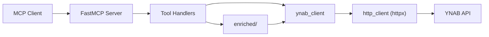

# ynab-mcp

An AI-first [Model Context Protocol](https://modelcontextprotocol.io/) server for [YNAB](https://ynab.com). It exposes the YNAB API as MCP tools for AI agents, then adds enriched read-only tools for orientation, triage, and bookkeeping workflows.

This repo is structured so a contributor or AI agent can answer three questions quickly:
- where the MCP server lives
- where YNAB API wrappers and models live
- where to add new tools, tests, and docs

## What this document is for

Read this page if you need:
- a quick understanding of the product
- local setup and run commands
- a map of the repository docs
- a high-level view of the architecture

Next reads:
- [Client Setup](docs/client-setup.md)
- [Architecture](docs/architecture.md)
- [Repo Structure](docs/repo-structure.md)
- [Tool Surface](docs/tool-surface.md)
- [Testing](docs/testing.md)
- [Security](docs/security.md)
- [Contributing](CONTRIBUTING.md)
- [Agent Guidance](AGENTS.md)
- [Docs Index](docs/README.md)
- [Legal Notice](NOTICE.md)
- [Postman Notes](postman/README.md)

## High-Level Architecture



## What it does

The server exposes two kinds of tools:

- **Raw tools**: close mirrors of YNAB endpoints. Use these for exact reads and all writes.
- **Enriched tools**: AI-friendly helpers that combine multiple reads into clearer workflows. Use these for orientation, investigation, and analysis.

Every tool is labeled `read` or `write`. Enriched tools do not perform hidden writes.

## How the Repo Is Organized

The code is centered around a small set of layers:

- `src/ynab_mcp/server/`: FastMCP app, tool metadata, tool registration, error boundary
- `src/ynab_mcp/ynab_client/`: one async wrapper module per YNAB resource family
- `src/ynab_mcp/http_client/`: outbound `httpx` wrapper with retries, redaction, and error normalization
- `src/ynab_mcp/models/`: typed YNAB shapes, shared error model, milliunit helpers
- `src/ynab_mcp/enriched/`: higher-level read-only workflows built on top of raw clients
- `tests/`: unit, contract, integration, and QA/Postman source assets

For the full tree and “where do I put X?” guidance, read [Repo Structure](docs/repo-structure.md).

## Quick Start

### 1. Get a YNAB Personal Access Token

Go to [app.ynab.com/settings/developer](https://app.ynab.com/settings/developer) and generate a token.

### 2. Install

```bash
git clone <repo-url>
cd ynab-mcp
uv sync
```

### 3. Configure

```bash
cp .env.example .env
# Edit .env: set YNAB_API_KEY and optionally YNAB_PLAN_ID
```

Most users have one budget. If you set `YNAB_PLAN_ID`, tools that accept `plan_id` can default to it.

### 4. Run Over stdio

```bash
make run-stdio
```

### 5. Verify

```bash
make smoke-stdio
```

## Use with MCP Clients

This repo works best today as a local `stdio` MCP server.

- easiest local path: **Claude Desktop**
- also suitable for: **Claude Code**, **Cursor**, and **Windsurf**
- hosted connector path: **ChatGPT custom connectors** require a remote/public MCP deployment rather than the local PAT quick start

For client-specific setup instructions, see [docs/client-setup.md](docs/client-setup.md).
A hosted/public connector is **not implemented**. The intent is for it to live
in its own repository so OAuth and public-app concerns stay out of this package;
the core exposes an embed surface for that purpose. Today this is a local,
personal-access-token server only.

## Tool Families

Start with `overview_available_tools`. It returns the current tool catalog grouped by family, including raw vs enriched classification and low-priority families.

| Family | Type | Purpose |
|--------|------|---------|
| `overview` | enriched | Budget health snapshots and orientation |
| `triage` | enriched | Transaction cleanup queues |
| `bookkeeping` | enriched | Categorization suggestions, memo help, history |
| `analysis` | enriched | Spending analysis, funding gaps, scheduled risks |
| `user` | raw | YNAB user info |
| `plans` | raw | Plan and settings reads |
| `accounts` | raw | Account reads and creation |
| `categories` | raw | Categories and category groups |
| `months` | raw | Month-level budget data |
| `payees` | raw | Payee management |
| `payee_locations` | raw | Geographic payee metadata, niche/low-priority |
| `transactions` | raw | Transaction CRUD and import trigger |
| `scheduled_transactions` | raw | Scheduled transaction management |
| `money_movements` | raw | Money movement data |

More detail: [Tool Surface](docs/tool-surface.md)

## Where to Read Next

If you are:

- **trying to connect a client**: read [Client Setup](docs/client-setup.md)
- **new to the repo**: read [Architecture](docs/architecture.md)
- **adding code**: read [Contributing](CONTRIBUTING.md), [Repo Structure](docs/repo-structure.md), and [Agent Guidance](AGENTS.md)
- **adding or changing tools**: read [Tool Surface](docs/tool-surface.md)
- **verifying behavior**: read [Testing](docs/testing.md)
- **working on auth, error handling, or logging**: read [Security](docs/security.md)

## Common Contributor Paths

### Add a raw tool

Read:
- [Contributing](CONTRIBUTING.md)
- [Repo Structure](docs/repo-structure.md)
- [Architecture](docs/architecture.md)
- [Agent Guidance](AGENTS.md)

### Add an enriched tool

Read:
- [Contributing](CONTRIBUTING.md)
- [Tool Surface](docs/tool-surface.md)
- [Architecture](docs/architecture.md)
- [Agent Guidance](AGENTS.md)

### Run the server

```bash
make run-stdio
make run-http
```

### Run tests

```bash
make test
make test-unit
make test-contract
make test-integration
make test-postman-operator
```

## Configuration

| Variable | Required | Description |
|----------|----------|-------------|
| `YNAB_API_KEY` | Yes | YNAB personal access token |
| `YNAB_PLAN_ID` | Recommended | Default plan ID to make `plan_id` optional on most tools |
| `LOG_LEVEL` | No | Logging verbosity, default `INFO` |

## Amount Convention

All YNAB monetary amounts are in **milliunits**: `1000 = $1.00`.

- Raw tools accept and return milliunits for canonical amount fields.
- Enriched tools may include display helpers alongside canonical values.

## Current State

The current implementation uses:
- Python 3.12
- `FastMCP` from the official `mcp` package
- `asyncio` end to end
- `httpx` for outbound YNAB calls
- built-in stdio and streamable HTTP transports from the current FastMCP stack

Hosted runtimes should import the core package through its embed surface instead
of adding OAuth, session, or database code to this repo. No hosted runtime
exists yet.

If architecture and implementation ever diverge, the source of truth should be [Architecture](docs/architecture.md), updated to reflect the actual code.

## License

Apache License 2.0. See [LICENSE](LICENSE) and [NOTICE.md](NOTICE.md).

## Disclaimer

We are not affiliated, associated, or in any way officially connected with YNAB or any of its subsidiaries or affiliates. The official YNAB website can be found at [https://www.ynab.com](https://www.ynab.com).

The names YNAB and You Need A Budget, as well as related names, tradenames, marks, trademarks, emblems, and images are registered trademarks of YNAB.
