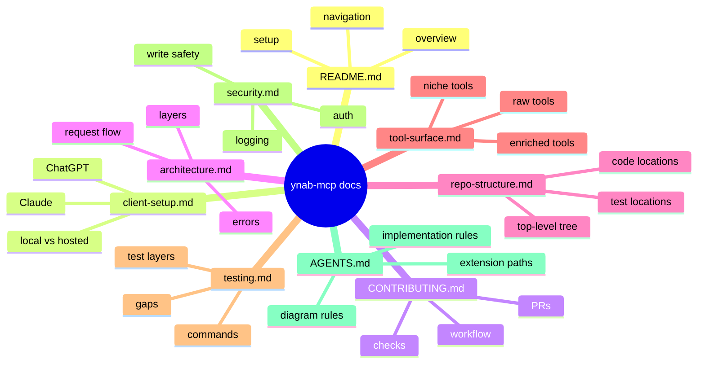

# Documentation Index

This page is the map for the repository documentation.

Hosted OAuth and public-app work is not implemented and is not documented here.
This tree covers the local, personal-access-token server.

## What this document is for

Read this page if you need:
- a quick way to find the right doc
- a recommended reading order
- a breakdown by audience
- Mermaid guidance for structural docs

## Documentation Map

## Recommended Reading Order

1. [README.md](../README.md)
2. [client-setup.md](client-setup.md)
3. [architecture.md](architecture.md)
4. [CONTRIBUTING.md](../CONTRIBUTING.md)
5. [AGENTS.md](../AGENTS.md)
6. [testing.md](testing.md)
7. [security.md](security.md)

## By Audience

### New users

Start with:
- [README.md](../README.md)
- [client-setup.md](client-setup.md)
- [security.md](security.md)

Use these to understand what the MCP is, how to run it, and what credentials it expects.

### Contributors

Start with:
- [architecture.md](architecture.md)
- [repo-structure.md](repo-structure.md)
- [CONTRIBUTING.md](../CONTRIBUTING.md)
- [testing.md](testing.md)

Use these to understand how the code is laid out and how to verify changes.

### AI agents

Start with:
- [AGENTS.md](../AGENTS.md)
- [architecture.md](architecture.md)
- [tool-surface.md](tool-surface.md)

Use these to understand where to add tools, how requests flow, and how the tool families are organized.

## Document Guide

### [README.md](../README.md)

Front door for the repo:
- product summary
- setup
- architecture snapshot
- doc navigation

### [client-setup.md](client-setup.md)

End-user client setup guide:
- Claude Desktop
- Claude Code
- Cursor
- Windsurf
- ChatGPT connector path

### [architecture.md](architecture.md)

System view of the current implementation:
- package layout
- request flow
- error flow
- server and transport choices

### [repo-structure.md](repo-structure.md)

Practical map of where things live:
- top-level directories
- `src/ynab_mcp` subtree
- where to add code by concern

### [tool-surface.md](tool-surface.md)

Guide to the MCP tool surface:
- raw vs enriched tools
- recommended entry points
- low-priority families

### [testing.md](testing.md)

How verification currently works:
- commands
- test layers
- actual current coverage
- known gaps

### [security.md](security.md)

Operational safety guidance:
- PAT handling
- log redaction
- write safety
- trust model

### [CONTRIBUTING.md](../CONTRIBUTING.md)

Contribution workflow guide:
- local setup
- coding and testing expectations
- pull request checklist
- docs and diagram update expectations

### [AGENTS.md](../AGENTS.md)

Implementation companion for AI agents and contributors:
- extension rules
- architecture invariants
- diagram update rules

## Mermaid Guidance

Use Mermaid for:
- architecture diagrams
- request and error flows
- repo structure overviews
- tool family maps

Prefer:
- `flowchart`
- `sequenceDiagram`
- `mindmap`

Keep diagrams:
- structural, not decorative
- short-labeled
- synchronized with code changes

## Adjacent References

- [Postman README](../postman/README.md)
- [Makefile](../Makefile)
