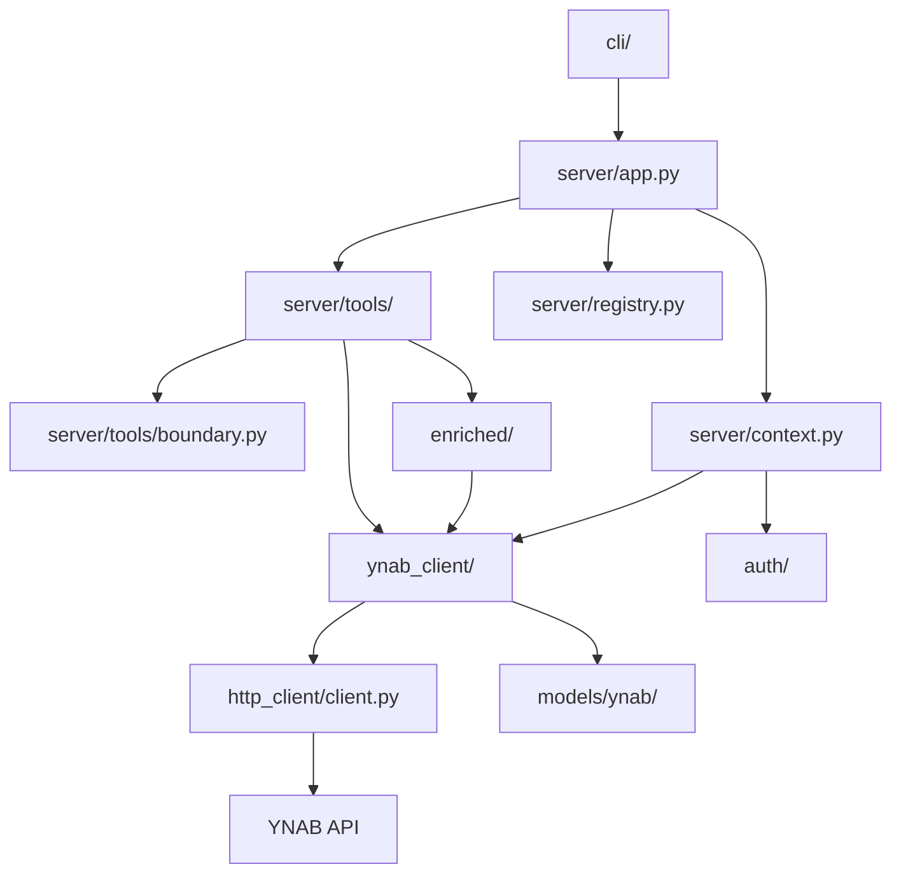
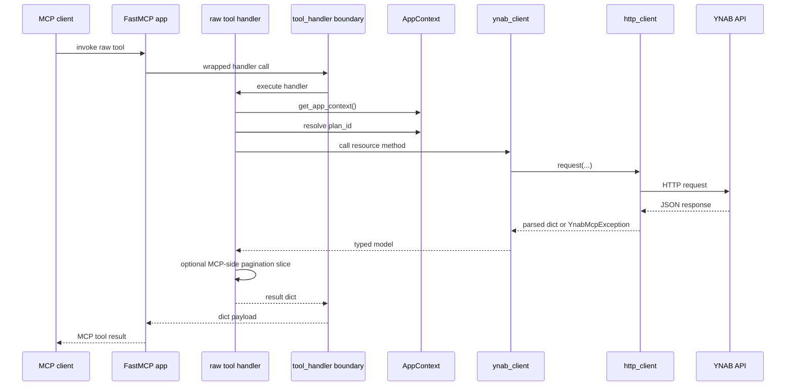
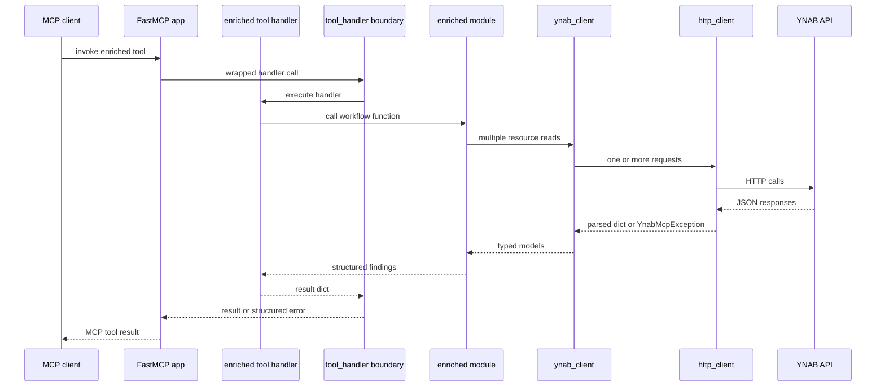
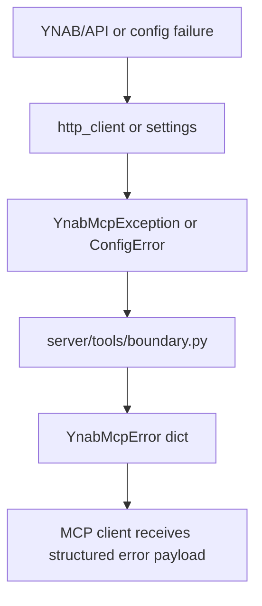
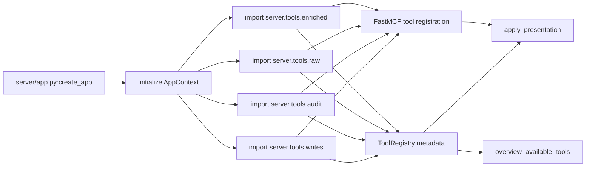

# Architecture

This document describes the current implementation of `mcp-server-for-ynab`.

## What this document is for

Read this page if you need:
- the actual package and layer structure
- request flow through the server
- error flow and tool boundary behavior
- current implementation notes where code differs from older plans

Adjacent docs:
- [Repo Structure](repo-structure.md)
- [Tool Surface](tool-surface.md)
- [Testing](testing.md)
- [Security](security.md)
- [Agent Guidance](../AGENTS.md)

## Product Model

`mcp-server-for-ynab` is an MCP server for AI agents. It exposes:
- raw tools that mirror the YNAB API closely
- enriched tools that consolidate common read workflows into more discoverable agent-facing operations

The system is optimized for:
- explicit tool contracts
- predictable writes
- agent discoverability
- async I/O across the stack

## Current Technical Baseline

| Concern | Current implementation |
|---------|------------------------|
| Python | 3.12 |
| Concurrency | `asyncio` |
| MCP framework | `FastMCP` from the `mcp` package |
| Outbound HTTP | `httpx` |
| Validation/models | `pydantic` v2 |
| Test stack | `pytest`, `pytest-asyncio`, `pytest-httpx` |

## Current State Notes

- The current server uses `FastMCP`, not a hand-built lower-level protocol layer.
- The CLI supports both `stdio` and HTTP transports today.
- HTTP transport currently runs through FastMCP’s built-in streamable HTTP mode rather than a dedicated `http_transport` package.
- Structured tool errors are handled through `server/tools/boundary.py`.

These are implementation truths and should be preferred over older planning assumptions.

## Package and Layer Overview



## Package Layout

```text
src/mcp_server_for_ynab/
├── auth/           auth abstraction and PAT provider
├── cli/            stdio/http entrypoints and smoke helper
├── config/         settings and environment loading
├── enriched/       consolidated read workflows, including multi-month audits
├── http_client/    outbound httpx client for YNAB API calls
├── models/         shared errors, amount helpers, typed YNAB models
├── server/         FastMCP app, context, metadata, tool boundary, tool registration
└── ynab_client/    async resource wrappers over the YNAB API
```

## Responsibilities by Layer

### `config/`

Loads runtime configuration:
- `YNAB_API_KEY`
- optional `YNAB_PLAN_ID`
- `LOG_LEVEL`

Also owns default plan resolution via `Settings.resolve_plan_id()`.

### `auth/`

Owns access token retrieval.

Current implementation:
- PAT-only via `PatAuthProvider`

Hosted runtimes may provide their own `AuthProvider` implementations outside
this repo and inject them through the embed API.

### `http_client/`

Owns outbound YNAB API concerns:
- auth header injection
- retries and backoff
- rate-limit handling
- header redaction
- normalization into the shared error contract

### `models/`

Owns:
- milliunit helpers
- shared `YnabMcpError`
- typed YNAB request/response models

### `ynab_client/`

Owns async wrappers around YNAB resource families:
- plans
- accounts
- categories
- months
- payees
- transactions
- scheduled transactions
- money movements

This is where YNAB route semantics belong, not in the server layer.

### `enriched/`

Owns higher-level read workflows, including:
- overview
- triage
- bookkeeping guidance
- analysis
- multi-month reads (`multi_month.py`), credit-card funding (`credit.py`),
  cross-month audits (`audit.py`), and delta sync (`changes.py`)

These modules combine multiple raw reads into structured agent-friendly outputs.

`multi_month.py` also owns the compact category projection used by
`months_get`, `categories_list`, and every range tool. Payload size is a design
constraint here rather than an optimization: one uncompacted month of a real
plan is about 60 KB, so a year of them cannot be read at all.

### `server/`

Owns MCP-facing concerns:
- FastMCP application factory
- shared app context
- request-scoped app context override for embedded runtimes
- tool metadata registry
- raw and enriched tool registration
- composed write tools (`server/tools/writes.py`) that journal several YNAB
  calls as one revertible entry
- client-side transaction filters (`server/tools/filters.py`) applied before
  paging, for the questions YNAB's routes cannot express
- derived tool titles, behavioural hints, and the journal sentence appended to
  every write description (`server/tools/presentation.py`)
- structured tool error boundary
- deterministic MCP-native pagination envelopes for oversized list responses

### `embed.py`

Owns the small supported import surface for hosted runtimes:
- create the shared FastMCP app without PAT startup wiring
- build an `AppContext` from any `AuthProvider`
- bind request-scoped context around hosted tool execution

### `cli/`

Owns entrypoints only:
- `stdio`
- HTTP/streamable HTTP
- smoke validation

Business logic should not accumulate here.

## Raw Request Lifecycle



Current implementation note:
- the `transactions_list*` raw tools use stateless MCP-side `limit` and `offset` parameters to keep payloads under client size limits
- YNAB route wrappers remain unchanged; the tool layer slices the already-filtered typed response and returns `items`, `count`, `total_available`, `has_more`, and optional `next_offset`

## Enriched Request Lifecycle



## Error Flow



The intended boundary behavior is:
- `YnabMcpException` becomes `{"error": ...}`
- `ConfigError` becomes `validation_error`
- unexpected exceptions become `internal_error`

The same boundary also handles pagination validation failures, such as invalid `limit` or `offset` values.

## Tool Registration Flow



`apply_presentation` runs last and projects registry metadata back onto the
registered tools: titles, `destructiveHint`, and the sentence telling an agent
whether a write can be undone. These are derived rather than written on each
decorator, so a new tool gets them without anyone remembering to.

For hosted runtimes, `embed.create_mcp_app()` reuses the same registration path
without forcing the PAT startup flow.

## AppContext and Shared Clients

`server/context.py` creates a shared `AppContext` at startup for the PAT runtime.
It also supports a request-scoped override for embedded hosted runtimes. An
`AppContext` contains:
- settings
- one shared `YnabHttpClient`
- initialized `ynab_client` instances for each resource family

This keeps tool handlers thin and keeps auth and client construction out of the
tool modules themselves.

## Tool Metadata Model

`server/registry.py` stores metadata for discoverability:
- tool name
- family
- classification
- tool type (`raw` vs `enriched`)
- summary
- optional priority

This metadata is separate from FastMCP’s protocol registration and is used by `overview_available_tools`.

## Amount Convention

YNAB canonical amounts are milliunits:
- `1000 = $1.00`
- raw tools use milliunits for canonical amount fields
- enriched outputs may include display helpers

All amount conversion logic belongs in `models/amounts.py`.

## Default Plan Resolution

Most tools accept `plan_id: str | None`.

Resolution behavior:
- use the explicit tool argument if present
- otherwise use `YNAB_PLAN_ID`
- otherwise return a validation-style failure through the tool boundary

## Delta Sync

The repo supports YNAB’s delta-sync semantics where available:
- raw tools accept `last_knowledge_of_server`
- responses expose `server_knowledge`
- enriched tools may pass through relevant sync state when useful
- `changes_since` wraps the three list routes behind one call, because the
  knowledge counter is plan-wide and threading it through three routes by hand
  is why delta sync went unused

There is no local sync cache layer in the current implementation.

## Truthfulness Rules for Future Updates

When the implementation changes, update this document if any of these move:
- package layout
- transport model
- request flow
- error boundary
- tool registration strategy

If a planned architecture differs from the current one, label it clearly as a future change rather than describing it as present reality.
