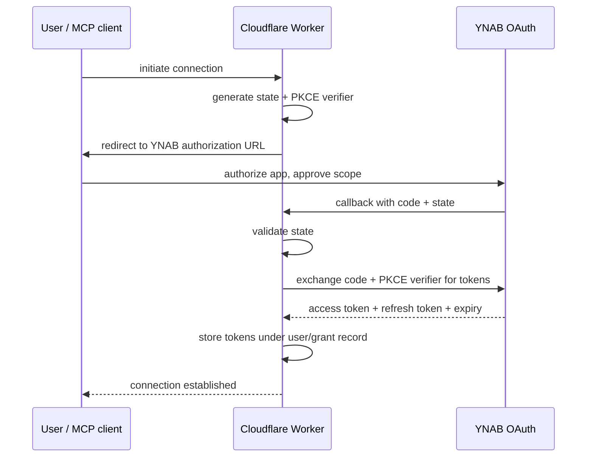
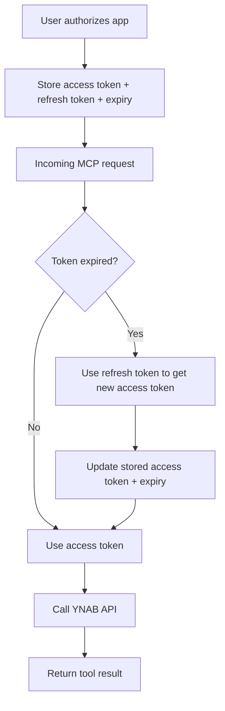

# OAuth Architecture

This document describes the planned OAuth architecture for the hosted deployment of ynab-mcp. It is decision-complete for implementation but has not yet been implemented. The current repo operates in PAT-only local mode.

Do not treat this as a description of the current codebase. Treat it as the implementation blueprint for the next major product track.

---

## Current state vs planned state

| Dimension | Current (local PAT) | Planned (hosted OAuth) |
|-----------|---------------------|------------------------|
| Deployment | Local machine, stdio | Cloudflare Worker |
| Auth | PAT from env var | Per-user OAuth access + refresh tokens |
| Users | Single user | Multi-user |
| Token storage | None (env var) | Cloudflare-managed storage |
| MCP transport | stdio | Streamable HTTP |
| Tool surface | Same | Same |

---

## OAuth flow

### Flow type

Authorization Code flow with PKCE.

- PKCE is included even though a confidential client secret is also used. Defense in depth.
- `state` parameter is required and validated on callback to prevent CSRF.
- Token exchange is performed server-side in the Cloudflare Worker. The authorization code never touches the client.

### Flow diagram

---

## Scope

The initial hosted deployment will use a read/write capable OAuth scope from the start. This gives users access to the full tool surface (raw reads and writes, enriched reads).

A read-only mode may be offered in the future. The code should be structured so a future read-only path can be added without requiring a full re-architecture.

---

## Default plan behavior

- Continue supporting explicit `plan_id` parameters on all tools.
- Support YNAB's optional default plan selection for OAuth apps: if YNAB provides a default plan in the OAuth grant metadata, store it alongside the grant record.
- Per-user default plan is preferred over a process-global setting in hosted mode.

---

## Deployment target

Cloudflare Worker.

The Worker is the only server-side component. It handles:
- OAuth callback and token exchange
- Token refresh
- MCP request routing
- YNAB API proxy

---

## Token and session storage

Use Cloudflare-managed storage primitives. The specific primitive (KV, D1, Durable Objects) should be selected based on consistency and TTL requirements at implementation time. This document does not mandate a specific primitive.

### What to store per user/grant

| Field | Notes |
|-------|-------|
| Access token | Short-lived; refreshed automatically |
| Refresh token | Long-lived; used to obtain new access tokens |
| Token expiry metadata | Used to determine when to refresh |
| OAuth session/grant record | Internal user ID, authorized plan ID if YNAB provides one |

### What not to store

- YNAB budget content as a durable dataset
- Passwords
- Authorization codes (used once in token exchange, then discarded)
- Any data beyond what is required to operate the connector

---

## Token lifecycle

If the refresh token is expired or revoked, the user must re-authorize. The Worker should return a clear error that the MCP client can surface.

---

## Auth provider model

### Local PAT mode (current)

- One process
- One token (from `YNAB_API_KEY` env var)
- Single user
- `PatAuthProvider` is process-global

### Hosted OAuth mode (planned)

- Per-user access token
- Per-user refresh token
- Per-user session/grant record
- The request context must identify the correct user/grant before any YNAB API call

The `auth/` layer already defines an abstract auth provider interface (`auth/base.py`). The hosted OAuth provider should implement the same interface, returning a per-user access token on each call rather than a global one.

---

## Callback behavior

- The redirect URI is a public endpoint on the Cloudflare Worker.
- The Worker validates `state` before proceeding with token exchange.
- The Worker performs the token exchange server-side only. The client never sees the authorization code or the client secret.
- Callback parameters (code, state) are never logged.

---

## MCP surface in hosted mode

The hosted OAuth deployment should expose the same logical tool surface as the local PAT mode. The auth provider becomes per-user in hosted mode rather than process-global, but tool handlers do not need to know whether they are running in PAT mode or OAuth mode.

The `AppContext` abstraction should make the auth provider injectable so the tool layer remains transport and auth-agnostic.

---

## Security requirements

These are locked decisions for the hosted implementation:

- Never request or store YNAB passwords
- Never log access tokens, refresh tokens, authorization codes, or plan contents
- Store only the minimum OAuth data required for operation
- Support explicit credential deletion on disconnect, revoke, or deletion request
- If the policy changes to cover additional data or new uses, users must be re-consented before those changes take effect
- Extend the existing log redaction rules in `http_client/client.py` to cover OAuth tokens and callback parameters

---

## User deletion / disconnect contract

When a user requests deletion or revokes the connection:

1. Revoke the access token and refresh token with YNAB (if the API supports programmatic revocation).
2. Delete the stored grant record and all associated tokens from Cloudflare storage.
3. Return confirmation to the user.

If YNAB does not provide a programmatic revocation endpoint, document this limitation in the deletion flow so users know they must also revoke from YNAB's developer settings.

---

## Open decisions before implementation

The following are not locked yet and should be decided before coding begins:

| Decision | Options | Notes |
|----------|---------|-------|
| Cloudflare storage primitive | KV, D1, Durable Objects | Pick based on consistency and TTL needs |
| Internal user identity model | Session cookie, MCP session ID, other | Must map request → grant record reliably |
| Token revocation behavior | Best-effort vs confirmed | Depends on what YNAB API supports |
| Read-only mode offering | Launch with read/write only vs offer both | Plan says read/write from start; revisit later |

---

## What is not implementation scope yet

- OAuth UI screens or consent page design
- Cloudflare Worker scaffolding or deployment config
- Client library or SDK for OAuth flow
- Billing, subscription, or metering

Implementation begins after the public/legal layer is in place: privacy policy live, branding locked, domain chosen.
