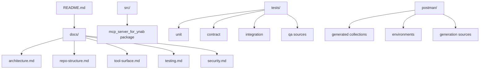

# Repo Structure

This document explains how the repository is organized and where to add new work.

## What this document is for

Read this page if you need:
- the top-level repo layout
- the `src/mcp_server_for_ynab` package layout
- guidance on where to add code, tests, docs, or generated assets

Adjacent docs:
- [Architecture](architecture.md)
- [Tool Surface](tool-surface.md)
- [Testing](testing.md)
- [Agent Guidance](../AGENTS.md)

## Top-Level Tree

```text
.
├── docs/            architecture, testing, security, structure, tool docs
├── .agents/         agent skills for contributors and AI assistants
├── postman/         generated collections, environments, generation sources
├── scripts/         Postman generation and live verification scripts
├── src/             product code
├── tests/           unit, contract, integration, and QA source assets
├── AGENTS.md        implementation guidance for AI agents
├── README.md        repo front door
├── Makefile         common commands
└── pyproject.toml   Python packaging and tool config
```

Local-only or non-product directories such as `.venv/`, `.pytest_cache/`, `.mypy_cache/`, `.ruff_cache/`, and `.claude/` should not be treated as product structure.

A hosted OAuth runtime is not implemented. When it is built, it belongs in its
own repository consuming this package's embed surface, not in this tree.

## Relationship Overview



## Product Code Tree

```text
src/mcp_server_for_ynab/
├── auth/           auth abstraction and PAT provider
├── cli/            stdio/http entrypoints and smoke helper
├── config/         settings and environment loading
├── embed.py        stable hosted-consumption surface for imported runtimes
├── enriched/       higher-level read analysis, bookkeeping, and multi-month audit logic
├── http_client/    outbound httpx wrapper for YNAB API calls
├── models/         shared errors, amount helpers, typed YNAB models
├── server/         MCPServer app, app context, metadata registry, tool handlers
└── ynab_client/    thin async YNAB API wrappers by resource family
```

## Server Subtree

```text
src/mcp_server_for_ynab/server/
├── app.py              MCPServer application factory
├── context.py          shared and request-scoped app context helpers
├── registry.py         tool metadata catalog
├── prompts.py          guided workflows, surfaced as MCP prompts
├── resources.py        reference guides, surfaced as MCP resources
└── tools/
    ├── audit.py        multi-month range and integrity tool registrations
    ├── boundary.py     structured error boundary for tool handlers
    ├── enriched.py     enriched tool registrations
    ├── filters.py      client-side transaction filters, applied before paging
    ├── pagination.py   MCP-native pagination envelope
    ├── presentation.py derived titles, hints, and write-safety sentences
    ├── writes.py       composed write tools journaled as one entry
    └── raw/            raw tool registrations by resource family
```

The `enriched/` package splits along the question being answered rather than the
YNAB resource being read:

```text
src/mcp_server_for_ynab/enriched/
├── analysis.py     single-month analysis and recurring charges
├── audit.py        cross-month audits and the balance identity
├── bookkeeping.py  categorization and memo suggestions
├── changes.py      delta sync behind one call
├── credit.py       credit accounts and their payment categories
├── multi_month.py  month ranges and the compact category projection
├── overview.py     orientation snapshots
└── triage.py       queues of work, with the non-work excluded
```

## Where to Add New Work

### Add a new raw tool

Add or update:
- typed models in `src/mcp_server_for_ynab/models/ynab/`
- async wrapper in `src/mcp_server_for_ynab/ynab_client/`
- MCP tool registration in `src/mcp_server_for_ynab/server/tools/raw/`
- contract test in `tests/contract/`
- integration test if the tool behavior is important at the MCP boundary

### Add a new enriched tool

Add or update:
- logic in `src/mcp_server_for_ynab/enriched/`
- registration in `src/mcp_server_for_ynab/server/tools/enriched.py`, or in
  `audit.py` if it reads a range of months
- unit tests for logic
- integration tests if boundary behavior matters

Anything that reads a range of months should build on
`enriched/multi_month.py` rather than looping `months.get` itself: the range
cap, month normalisation, and the concurrency limit live there, and a tool that
skips them can spend an hour's request budget in one call.

### Add a new YNAB model

Use:
- `src/mcp_server_for_ynab/models/ynab/` for YNAB request/response shapes
- `src/mcp_server_for_ynab/models/errors.py` for shared error contract changes
- `src/mcp_server_for_ynab/models/amounts.py` for amount conversion logic

### Add contract tests

Use:
- `tests/contract/test_<resource>.py`

These should verify:
- method and path
- query params
- payload shape
- response parsing

### Add integration tests

Use:
- `tests/integration/`

These should focus on:
- startup
- tool registration
- real MCP-boundary behavior
- structured error handling

### Add Postman source material

Use:
- `postman/sources/` for source-of-truth inputs
- `tests/qa/features/` and `tests/qa/cases/` for QA scenarios

Do not edit generated JSON directly unless the generation process itself is being replaced.

## What Not to Add Where

- Do not add business logic to `cli/`; keep it in `enriched/`, `ynab_client/`, or `server/`.
- Do not add YNAB endpoint wrappers directly to `server/tools/`; put HTTP-facing YNAB logic in `ynab_client/`.
- Do not add hosted OAuth, session, or durable grant logic to the core package; it belongs in a separate hosted repository.
- Do not treat `.agents/` or `.claude/` as the primary shared documentation surface; use repo docs instead.
- Do not place generated assets under `src/`.

## Current State Notes

- The current server implementation uses `MCPServer` from the `mcp` package.
- HTTP transport currently runs through the CLI via MCPServer’s streamable HTTP support rather than a dedicated `http_transport` package.
- `server/tools/boundary.py` is now part of the actual MCP boundary and should be reflected in any architecture update.
