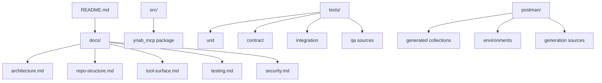

# Repo Structure

This document explains how the repository is organized and where to add new work.

## What this document is for

Read this page if you need:
- the top-level repo layout
- the `src/ynab_mcp` package layout
- guidance on where to add code, tests, docs, or generated assets

Adjacent docs:
- [Architecture](architecture.md)
- [Tool Surface](tool-surface.md)
- [Testing](testing.md)
- [Agent Guidance](../AGENTS.md)

## Top-Level Tree

```text
.
├── docs/            architecture, testing, security, structure, tool docs
├── ynab-mcp-hosted/ temporary staging area for the future hosted OAuth repo
├── postman/         generated collections, environments, generation sources
├── scripts/         Postman generation and live verification scripts
├── src/             product code
├── tests/           unit, contract, integration, and QA source assets
├── AGENTS.md        implementation guidance for AI agents
├── README.md        repo front door
├── Makefile         common commands
└── pyproject.toml   Python packaging and tool config
```

Local-only or non-product directories such as `.venv/`, `.pytest_cache/`, `.mypy_cache/`, `.ruff_cache/`, `.agents/`, and `.claude/` should not be treated as product structure.
The `ynab-mcp-hosted/` directory is product work, but it is intentionally not
part of the core package. It is a cut-out-ready future repository.

## Relationship Overview



## Product Code Tree

```text
src/ynab_mcp/
├── auth/           auth abstraction and PAT provider
├── cli/            stdio/http entrypoints and smoke helper
├── config/         settings and environment loading
├── embed.py        stable hosted-consumption surface for imported runtimes
├── enriched/       higher-level read-only analysis and bookkeeping logic
├── http_client/    outbound httpx wrapper for YNAB API calls
├── models/         shared errors, amount helpers, typed YNAB models
├── server/         FastMCP app, app context, metadata registry, tool handlers
└── ynab_client/    thin async YNAB API wrappers by resource family
```

## Server Subtree

```text
src/ynab_mcp/server/
├── app.py              FastMCP application factory
├── context.py          shared and request-scoped app context helpers
├── registry.py         tool metadata catalog
└── tools/
    ├── boundary.py     structured error boundary for tool handlers
    ├── enriched.py     enriched tool registrations
    └── raw/            raw tool registrations by resource family
```

## Where to Add New Work

### Add a new raw tool

Add or update:
- typed models in `src/ynab_mcp/models/ynab/`
- async wrapper in `src/ynab_mcp/ynab_client/`
- MCP tool registration in `src/ynab_mcp/server/tools/raw/`
- contract test in `tests/contract/`
- integration test if the tool behavior is important at the MCP boundary

### Add a new enriched tool

Add or update:
- logic in `src/ynab_mcp/enriched/`
- registration in `src/ynab_mcp/server/tools/enriched.py`
- unit tests for logic
- integration tests if boundary behavior matters

### Add a new YNAB model

Use:
- `src/ynab_mcp/models/ynab/` for YNAB request/response shapes
- `src/ynab_mcp/models/errors.py` for shared error contract changes
- `src/ynab_mcp/models/amounts.py` for amount conversion logic

### Add contract tests

Use:
- `tests/contract/test_<resource>.py`

These should verify:
- method and path
- query params
- payload shape
- response parsing

### Add integration tests

Use:
- `tests/integration/`

These should focus on:
- startup
- tool registration
- real MCP-boundary behavior
- structured error handling

### Add Postman source material

Use:
- `postman/sources/` for source-of-truth inputs
- `tests/qa/features/` and `tests/qa/cases/` for QA scenarios

Do not edit generated JSON directly unless the generation process itself is being replaced.

## What Not to Add Where

- Do not add business logic to `cli/`; keep it in `enriched/`, `ynab_client/`, or `server/`.
- Do not add YNAB endpoint wrappers directly to `server/tools/`; put HTTP-facing YNAB logic in `ynab_client/`.
- Do not add hosted OAuth, session, or durable grant logic to the core package; keep it in `ynab-mcp-hosted/`.
- Do not treat `.agents/` or `.claude/` as the primary shared documentation surface; use repo docs instead.
- Do not place generated assets under `src/`.

## Current State Notes

- The current server implementation uses `FastMCP` from the `mcp` package.
- HTTP transport currently runs through the CLI via FastMCP’s streamable HTTP support rather than a dedicated `http_transport` package.
- `server/tools/boundary.py` is now part of the actual MCP boundary and should be reflected in any architecture update.
