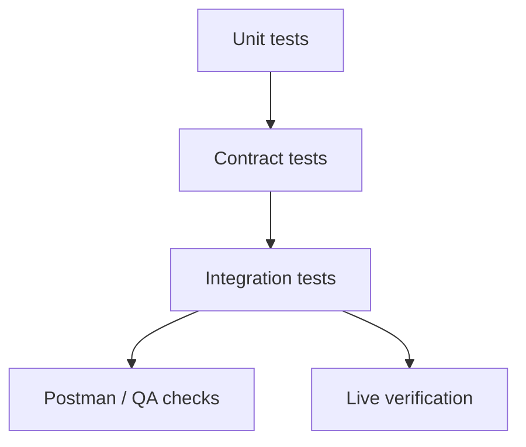

# Testing

This document explains how the current test suite is organized, what it verifies today, and where the remaining gaps are.

## What this document is for

Read this page if you need:
- test commands
- the purpose of each test layer
- the difference between implemented checks and planned checks
- where QA and Postman assets fit

Adjacent docs:
- [Architecture](architecture.md)
- [Repo Structure](repo-structure.md)
- [Security](security.md)

## Test Layers



Interpretation:
- unit tests are fastest and most isolated
- contract tests validate route wrappers and payloads
- integration tests validate app assembly and MCP-facing behavior
- Postman and QA assets exercise external verification workflows
- live verification calls the real API and the real MCP transport

Every layer above live verification runs against payloads we wrote. That is
the layer's blind spot: a response model that disagrees with the real YNAB API
passes all of them. Live verification is the only layer that can catch it.

## Commands

```bash
make lint
make format
make typecheck
make test
make test-unit
make test-contract
make test-integration
make check
make smoke-stdio
make run-stdio
make run-http
make verify-live
make verify-mcp-http
make postman-generate
make postman-check
make test-postman
make test-postman-operator
```

## Current State

The current suite verifies a meaningful portion of the codebase, but the coverage is uneven by layer.

Implemented today:
- unit tests for config, HTTP client retry behavior, amount helpers, and shared errors
- contract tests for the transactions client
- integration tests for app creation, tool metadata/registration, structured error handling, and transaction pagination behavior
- QA source assets and generated Postman collections

- live verification scripts for the real API and the MCP HTTP transport

Not yet fully implemented:
- broad contract coverage for every `ynab_client` resource
- MCP-boundary integration tests that invoke representative tools and assert structured error payloads
- automated transport parity checks between stdio and HTTP; both transports are
  exercised by the live verification scripts, but nothing asserts they agree

This doc intentionally reflects the current suite rather than the ideal future suite.

## Test Directory Map

```text
tests/
├── contract/      route wrapper and payload tests
├── fixtures/      reusable JSON payloads and request bodies
├── integration/   app assembly and MCP-facing behavior
├── qa/            feature and case sources for generated Postman collections
└── unit/          isolated logic tests
```

## Layer by Layer

### Unit tests

Location:
- `tests/unit/`

Purpose:
- verify isolated logic without real network calls

Currently covers:
- config loading and default plan resolution
- shared error model
- milliunit helpers
- HTTP retry and error mapping behavior
- pagination helper validation and envelope behavior

Fastest layer:
- yes

Best place to add:
- helper logic
- parsing/validation behavior
- enriched heuristics

### Contract tests

Location:
- `tests/contract/`

Purpose:
- verify `ynab_client` resource wrappers use the correct path, method, params, and shape

Currently covers:
- transactions client behavior
- money movements client behavior, driven by recorded live payloads
- delta-sync parameters
- typed transaction response parsing

Current gap:
- most other resource wrappers do not yet have the same contract coverage

When the point of the test is that a model matches the real API, load a
recorded payload from `tests/fixtures/` with `load_fixture()` instead of
writing the dict by hand. A hand-written payload only proves the model agrees
with itself.

Best place to add:
- new raw YNAB route coverage
- endpoint-specific payload assertions

### Integration tests

Location:
- `tests/integration/`

Purpose:
- verify the assembled app and MCP-facing registration behavior

Currently covers:
- app creation
- tool registry population
- family/classification metadata presence
- structured tool-boundary error serialization
- transaction list pagination envelopes and invalid pagination inputs

Current gap:
- the current integration suite does not yet exercise representative tool invocation through the MCP boundary as thoroughly as the architecture intends
- error-shape assertions at the actual tool boundary still deserve stronger coverage

Best place to add:
- startup and transport behavior
- real tool invocation
- boundary error handling

### QA and Postman checks

Locations:
- `tests/qa/features/`
- `tests/qa/cases/`
- `postman/collections/`
- `postman/environments/`
- `postman/sources/`

Purpose:
- maintain generated Postman collections
- support external verification via Newman

Current behavior:
- collections are generated from YAML/feature sources
- `make postman-check` detects drift in generated collections
- `make test-postman` and `make test-postman-operator` run Newman if credentials and tool prerequisites are present

These are slower and more operational than unit/contract tests.

### Live verification

Locations:
- `scripts/live_read_sweep.py`
- `scripts/mcp_http_check.sh`

Purpose:
- verify the response models still match what YNAB actually sends
- verify an MCP client can connect, list tools, and invoke them

Commands:

```bash
make verify-live       # every read-only tool against the live API
make verify-mcp-http   # MCP HTTP handshake, driven by curl
```

`verify-live` drives the server as a real MCP client over stdio. It selects
tools by the `readOnlyHint` annotation, so new read tools are swept
automatically and writes are never invoked. Tools whose required argument has
no value in the plan — a per-record tool for a resource the plan has none of —
are reported as skipped rather than failed.

`verify-mcp-http` starts the server on a throwaway port and walks the protocol
by hand: initialize, `notifications/initialized`, `tools/list`, `tools/call`,
an unknown-tool call, and a request with no session id. It asserts a session id
is issued, every tool carries a schema and description, and an unknown tool
comes back as a tool error rather than a transport failure.

Both need real credentials, so neither is part of `make check`. Run them after
changing a response model, adding a tool, or upgrading the `mcp` SDK.

## Which Tests Are Fast vs End-to-End

| Layer | Speed | External dependencies | Notes |
|------|-------|------------------------|-------|
| Unit | Fast | None | Best first pass |
| Contract | Fast | Mocked HTTP only | Best for raw client accuracy |
| Integration | Medium | Local app assembly | Good for wiring and metadata |
| Postman/Newman | Slowest | Credentials, Newman, runtime env | External verification path |

## Fixtures

Fixtures currently live in:
- `tests/fixtures/`

Use them for:
- request body examples
- known response payloads
- edge-case input validation

Load them with `load_fixture("name.json")` from `tests/conftest.py`.

When adding fixtures:
- keep them small
- make the scenario obvious from the filename
- prefer reusable payloads over one-off blobs
- record response payloads from a live call and replace the identifiers, rather
  than writing them from the model definition
- cover the variants that matter: null fields, negative amounts, absent optional
  relationships

## Async Testing

The repo uses `pytest-asyncio` with `asyncio_mode = "auto"` from `pyproject.toml`.

That means:
- async tests can be written directly as `async def`
- async wrappers and helpers should be tested without sync shims

## Generated Postman Artifacts

Generated artifacts live in:
- `postman/collections/`
- `postman/environments/`

Source-of-truth inputs live in:
- `postman/sources/`
- `tests/qa/features/`
- `tests/qa/cases/`

Edit the source inputs, not just the generated JSON.

## Recommended Verification Flow

For most code changes:

1. `make lint`
2. `make typecheck`
3. `make test-unit`
4. `make test-contract`
5. `make test-integration`

For changes affecting generated API verification assets:

1. `make postman-generate`
2. `make postman-check`
3. `make test-postman-operator` if credentials are available

## Planned Improvements

The current suite would benefit from:
- contract tests for all raw resource wrappers
- stronger integration tests that invoke actual tool handlers
- explicit MCP-boundary error-shape assertions
- clearer parity checks between stdio and HTTP transports

These are planned improvements, not claims about current coverage.
