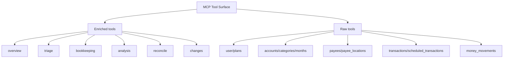

# Tool Surface

This document explains how the MCP tool surface is organized and how to choose the right tool family.

## What this document is for

Read this page if you need:
- a map of raw vs enriched tools
- guidance on where to start
- context on low-priority families
- a contributor view of the current surface area

Adjacent docs:
- [Architecture](architecture.md)
- [Repo Structure](repo-structure.md)
- [Agent Guidance](../AGENTS.md)

## Tool Family Map

## How to Choose a Tool

Start with enriched tools when you want:
- orientation
- budget health summaries
- bookkeeping investigation
- transaction cleanup queues
- analysis across multiple YNAB resources

Use raw tools when you want:
- exact YNAB data
- explicit writes
- direct control over route semantics
- precise access to delta-sync parameters

## Recommended Starting Path

For most AI-agent workflows:

1. call `overview_available_tools`
2. use an enriched `overview_*`, `triage_*`, `bookkeeping_*`, or `analysis_*` tool to orient
3. switch to raw tools when you need exact reads or explicit writes

## Enriched Tool Families

### `overview`

Purpose:
- first-pass understanding of the budget
- cash position
- month health
- tool discovery

Good first tools:
- `overview_available_tools`
- `overview_budget_snapshot`
- `overview_month_health`
- `overview_cash_position`

### `triage`

Purpose:
- find transactions that need attention

Typical uses:
- uncategorized transactions
- unapproved transactions
- hand-entered transactions on linked accounts that never cleared
- imported card authorisations that never posted
- accounts nobody has reconciled recently

A queue is only useful if everything in it is work. YNAB's `type=uncategorized`
filter is not that queue: on a live plan it returned 519 transactions of which
none actually needed a category. The rest were transactions on an off-budget
tracking account, which take no category, and transfers between two on-budget
accounts, which take no category either.

`triage_uncategorized` therefore excludes both by default, reports `count` as
the number needing attention and `raw_count` as what YNAB's own filter said, and
breaks down what it excluded. `include_transfers` and `include_tracking_accounts`
bring them back. A transfer *out* to a tracking account is not excluded — that
money leaves the budget and does need a category.

`triage_unmatched_manual` and `triage_pending_imports` are two queues that look
alike and never overlap, because the test is the same field read two ways. A
hand-entered transaction has no `import_id` and means the bank never matched a
promise someone made. A stuck card authorisation *has* one, beginning `YNAB:P:`,
and means YNAB imported a hold that the real charge never replaced. Either way
the account is wrong by the queue's net amount.

### `bookkeeping`

Purpose:
- help an agent make better follow-up decisions

Typical uses:
- categorization suggestions
- memo suggestions
- transaction or payee history

### `analysis`

Purpose:
- higher-level budget reasoning

Typical uses:
- overspending, in one month or across a range
- funding gaps
- scheduled-transaction risk
- recurring charges
- credit-card funding and trapped money
- assignments copied forward without review
- following one category's money through time
- transfers between on-budget accounts that funded nothing
- assignments that quietly track a category's own inflow

### `reconcile`

Purpose:
- decide whether an account agrees with its statement, and close the gap

| Tool | Answers |
|------|---------|
| `reconcile_preview` | Cleared balance as of a date against the statement, and the four queues that explain a difference |
| `transactions_match_statement` | Which bank rows pair with which register rows, and what is left over on each side |
| `reconcile_apply` | Marks the agreed transactions reconciled and posts the adjustment, as one journaled write |

Every primitive this needs already existed; what was missing was the workflow,
and the work was being done by hand against CSVs. Three judgements are worth
knowing before using it:

- The cleared balance is computed **as of a date**, from the register, not read
  off the account. A statement is a date and `cleared_balance` is always now.
- Matching is on exact amount within a date tolerance, one-to-one, and nothing
  fuzzy is attempted. A near-match reported as a match hides the transaction
  that was being looked for; an unmatched row is what gets investigated.
- YNAB's API has no route that sets `last_reconciled_at`. Marking three hundred
  transactions reconciled leaves that date untouched, so the app still says the
  account was last reconciled whenever it last happened there. Every response
  that could mislead says so, because the user will open YNAB and check.

### `changes`

Purpose:
- re-check a plan cheaply after the user has edited it

`changes_since` wraps YNAB's delta sync, which is on every list route and almost
never used because using it means knowing the knowledge counter is plan-wide
rather than per-route and threading one integer through three calls. Called with
no argument it returns a baseline; called with a value it returns what moved.

### Reading across months

YNAB has no range endpoint, so anything spanning months costs one request per
month. That is the constraint these tools are shaped around, and each one states
its cost in its description.

| Tool | Answers |
|------|---------|
| `months_range` | Budgeted, activity and balance per category per month, as one matrix |
| `category_groups_summary_by_month` | The same at group level |
| `analysis_overspent_history` | Every negative month-end balance, cash or credit, and what Ready to Assign absorbed |
| `analysis_group_parity` | Whether two paired groups are funded and spent evenly |
| `analysis_copied_forward_months` | Months that repeat the previous month exactly |
| `analysis_flow_trace` | One category's assigned, moved, spent, refunded and left |
| `analysis_credit_funding` | Card debt against payment-category funds, and money stranded in closed accounts |
| `analysis_unassigned_transfers` | Transfers between on-budget accounts, against what the named groups were assigned |
| `analysis_assignment_patterns` | Categories assigned a fixed base plus the money that arrived in them that month |
| `overview_balance_identity` | Whether the plan adds up at all |

Ranges are capped at 36 months, which is refused with the reason rather than
silently truncated.

`overview_balance_identity` is the one to run first. Categories plus Ready to
Assign equals on-budget accounts plus credit-card debt, and that holds whether
or not the cards are funded — so a mismatch means the data is inconsistent
rather than the budgeting being wrong. If it ties, the rest can be trusted.

## Raw Tool Families

### Core operational families

- `user`
- `plans`
- `accounts`
- `categories`
- `months`
- `payees`
- `transactions`
- `scheduled_transactions`
- `money_movements`

These are the main resource families an agent will use for exact reads and writes.

#### Write tools are absent unless enabled

Set `YNAB_ALLOW_WRITES=1` to register them. Without it, the write tools do not
reach MCPServer at all: they are missing from `tools/list` and from
`overview_available_tools`, so an agent has no way to discover or call them.

The registry follows the same rule, so the catalog never advertises a tool the
server will not run.

#### History and rollback

The `history` family records every write with the state that preceded it, and
can put a plan back. `history_list` and `history_show` are reads and are always
available; `history_revert` and `history_revert_to` are writes and follow the
same opt-in as everything else.

Creating an account, category, category group, or payee cannot be undone —
YNAB has no delete route for them. Those entries are recorded as non-revertible
with the reason, and a rollback reports them rather than skipping them.

#### Money movements are not transactions

`money_movements` is the family most often misread. A money movement records
budgeted funds moved between categories within a month. No money enters or
leaves the plan, and the record has no date, payee, or account. Its fields are
`month`, `moved_at`, `from_category_id`, `to_category_id`, `amount`, and
`money_movement_group_id`.

- a null `from_category_id` or `to_category_id` means Ready to Assign
- a money movement group ties together the movements made in one action; it
  carries no amount and does not embed its movements — join on
  `money_movement_group_id`
- to answer "where did the money go", use the transaction tools instead

#### Batch writes compose raw writes, and are journaled as one entry

`months_assign_many`, `money_move` and `reconcile_apply` are write tools that
make several YNAB calls. They exist because the API's unit — one category, one
month, one absolute amount; one transaction, one field — is not the unit of the
decision. Applying a month's plan is thirty-five writes; moving money is two
writes whose amounts have to be computed from carried balances; finishing a
reconciliation is a bulk status change and, usually, an adjustment transaction
that only makes sense alongside it.

Each is journaled as a single history entry, so one decision reverts as one
decision. None is atomic — YNAB has no transaction boundary — so each reports
what was applied and what failed, and a half-written `money_move` is journaled
anyway, because that is precisely the case where a revert is needed.
`reconcile_apply` is the case where the entry holds two kinds of change: the
revert restores the cleared statuses *and* deletes the adjustment, since undoing
one without the other leaves the account wrong by the amount in dispute.

#### Category writes have two separate routes

Budgeted amounts are per-month, and only `categories_update_for_month` can set
them. `categories_update` changes the name and note; YNAB accepts a `budgeted`
field on that route and silently ignores it, so the tool no longer exposes one.

`categories_update_for_month` and `months_assign_many` each take `budgeted` (the
new total) or `adjust_by` (a signed amount added to what is there), and exactly
one of the two. The delta exists because both tools already read the current
value for the journal, so a caller doing read-then-replace pays for that read
twice.

It is worth being exact about what `adjust_by` does *not* buy, because the
opposite is the natural assumption. It is not atomic. YNAB's API has neither a
delta operation nor a conditional update, so the server reads the amount and
writes the sum, and an edit made in the app between those two calls is
overwritten with no error. The delta narrows that window from the width of the
caller's turn to the width of one HTTP call; it does not close it.

`expected_budgeted`, on both tools, is what can be done about it, and it is
worth being equally exact about its limit. The caller states the amount it
believes is assigned; the tool compares that against the amount it reads, and
refuses rather than writes when they differ — a conflict for the single-category
tool, a failed line for the batch, with the rest of the batch still applied.

That catches a caller acting on a figure that had already moved: an assistant
that read the month a few turns ago, or a user who edited the plan in the app
meanwhile. It is not a compare-and-set. The comparison happens here, and the
PATCH that follows carries no precondition, so a change landing in the gap
between the two is overwritten in silence exactly as it would have been without
the field. The narrow window cannot be closed from this side of the API; the
wide one can, and that is the whole of what this buys.

`categories_create` requires a `category_group_id`. Get one from
`categories_list` or create a group first with `category_groups_create`.

Neither categories, category groups, accounts, nor payees can be deleted
through the YNAB API. Only transactions and scheduled transactions have delete
routes.

### Niche / low-priority family

- `payee_locations`

These tools expose geographic metadata from bank-import-related payee location data.

Guidance:
- include them for completeness
- do not treat them as a common starting point
- mark them as low-priority in discoverability views

## Raw vs Enriched Expectations

### Raw tools

- close to YNAB API semantics
- include canonical fields
- use milliunits for amounts
- support explicit writes

Current transaction-list note:
- the `transactions_list*` raw tools now return an MCP-native pagination envelope with `items`, `count`, `has_more`, and `next_offset`
- use `next_offset` as the next call's `offset` when the tool reports more results
- `limit` defaults to 100 and is capped at 500; the cap is in the tool description rather than discovered through an error
- they also accept `cleared`, `approved`, `manual_only`, and `min_amount`, which YNAB's routes do not support. These are applied before paging, so `total_available` counts matches rather than rows
- `fields` projects each item down to the columns named, and `id` comes along whether or not it was asked for. A reconciliation reading `date`, `amount`, `cleared` and `import_id` is a fraction of the full row
- null and empty members are dropped from every item regardless, which is most of a transaction's bytes. The response says so, because a *missing* `category_id` means the transaction is uncategorized rather than that the field was withheld

#### Payload size is a design constraint

A single `months_get` on a real plan is about 60 KB, because YNAB returns every
goal field of every category. `months_get` and `categories_list` therefore take
`compact=true`, which returns `id`, `group`, `name`, `budgeted`, `activity` and
`balance` and nothing else — about a quarter of the size, measured on a
ninety-category plan.

Both also exclude hidden and deleted categories unless `include_hidden=true`,
and report `omitted_category_count` so the omission is visible. Hidden is not a
display preference in YNAB: the credit-card payment categories live in a hidden
group, which is why `analysis_credit_funding` exists and why `include_hidden`
does.

### Enriched tools

- combine multiple raw reads
- are easier for agents to discover
- add rationale and context
- do not perform hidden writes

#### Every response carries what is left of the hour

The rate limit, not payload size, is what ends a long working session, and an
agent cannot pace itself against a number it has to spend a call to see. So the
tool boundary attaches `requests_used_this_hour` and `requests_remaining` to
every response, success or failure — two integers, on the answer the caller
already has.

`overview_request_budget` carries the rest: the limit, the window, and when an
exhausted budget reopens. `ping` answers whether the server is reachable at all
without touching YNAB, which is what an agent coming back from a rate limit
needs and cannot get from a call that spends the quota it is waiting on.

The quota is per access token and shared with the user's own YNAB apps, so the
count is what this server spent rather than what YNAB has left. Rate-limit
errors say that, and carry `retry_at` as an absolute timestamp beside
`retry_after`, so a scheduled retry does not drift into coming back early.

## Contributor Guidance

When adding a new tool, decide first:

- Is this a direct YNAB route? Add a raw tool.
- Is this an agent-facing workflow built from multiple reads? Add an enriched tool.

Avoid:
- putting YNAB route semantics inside enriched modules
- hiding writes inside enriched helpers
- duplicating raw behavior under a new enriched name without added agent value

## Current State Notes

- The repo already has enough tools that discoverability matters.
- `overview_available_tools` is part of the tool surface strategy, not just a convenience feature.
- If a new tool family is added, this document and the related diagrams should be updated in the same change.
