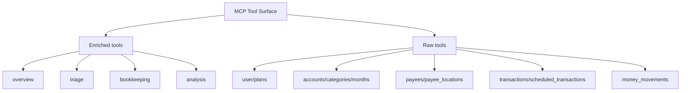

# Tool Surface

This document explains how the MCP tool surface is organized and how to choose the right tool family.

## What this document is for

Read this page if you need:
- a map of raw vs enriched tools
- guidance on where to start
- context on low-priority families
- a contributor view of the current surface area

Adjacent docs:
- [Architecture](architecture.md)
- [Repo Structure](repo-structure.md)
- [Agent Guidance](../AGENTS.md)

## Tool Family Map

## How to Choose a Tool

Start with enriched tools when you want:
- orientation
- budget health summaries
- bookkeeping investigation
- transaction cleanup queues
- analysis across multiple YNAB resources

Use raw tools when you want:
- exact YNAB data
- explicit writes
- direct control over route semantics
- precise access to delta-sync parameters

## Recommended Starting Path

For most AI-agent workflows:

1. call `overview_available_tools`
2. use an enriched `overview_*`, `triage_*`, `bookkeeping_*`, or `analysis_*` tool to orient
3. switch to raw tools when you need exact reads or explicit writes

## Enriched Tool Families

### `overview`

Purpose:
- first-pass understanding of the budget
- cash position
- month health
- tool discovery

Good first tools:
- `overview_available_tools`
- `overview_budget_snapshot`
- `overview_month_health`
- `overview_cash_position`

### `triage`

Purpose:
- find transactions that need attention

Typical uses:
- uncategorized transactions
- unapproved transactions

### `bookkeeping`

Purpose:
- help an agent make better follow-up decisions

Typical uses:
- categorization suggestions
- memo suggestions
- transaction or payee history

### `analysis`

Purpose:
- higher-level budget reasoning

Typical uses:
- overspending
- funding gaps
- scheduled-transaction risk

## Raw Tool Families

### Core operational families

- `user`
- `plans`
- `accounts`
- `categories`
- `months`
- `payees`
- `transactions`
- `scheduled_transactions`
- `money_movements`

These are the main resource families an agent will use for exact reads and writes.

#### Money movements are not transactions

`money_movements` is the family most often misread. A money movement records
budgeted funds moved between categories within a month. No money enters or
leaves the plan, and the record has no date, payee, or account. Its fields are
`month`, `moved_at`, `from_category_id`, `to_category_id`, `amount`, and
`money_movement_group_id`.

- a null `from_category_id` or `to_category_id` means Ready to Assign
- a money movement group ties together the movements made in one action; it
  carries no amount and does not embed its movements — join on
  `money_movement_group_id`
- to answer "where did the money go", use the transaction tools instead

### Niche / low-priority family

- `payee_locations`

These tools expose geographic metadata from bank-import-related payee location data.

Guidance:
- include them for completeness
- do not treat them as a common starting point
- mark them as low-priority in discoverability views

## Raw vs Enriched Expectations

### Raw tools

- close to YNAB API semantics
- include canonical fields
- use milliunits for amounts
- support explicit writes

Current transaction-list note:
- the `transactions_list*` raw tools now return an MCP-native pagination envelope with `items`, `count`, `has_more`, and `next_offset`
- use `next_offset` as the next call's `offset` when the tool reports more results
- this pagination is deterministic and stateless; it does not change YNAB's underlying API behavior

### Enriched tools

- combine multiple raw reads
- are easier for agents to discover
- add rationale and context
- do not perform hidden writes

## Contributor Guidance

When adding a new tool, decide first:

- Is this a direct YNAB route? Add a raw tool.
- Is this an agent-facing workflow built from multiple reads? Add an enriched tool.

Avoid:
- putting YNAB route semantics inside enriched modules
- hiding writes inside enriched helpers
- duplicating raw behavior under a new enriched name without added agent value

## Current State Notes

- The repo already has enough tools that discoverability matters.
- `overview_available_tools` is part of the tool surface strategy, not just a convenience feature.
- If a new tool family is added, this document and the related diagrams should be updated in the same change.
