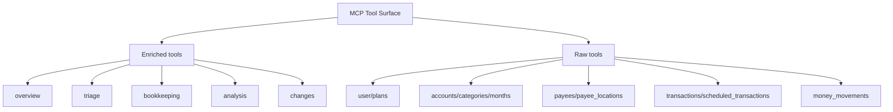

# Tool Surface

This document explains how the MCP tool surface is organized and how to choose the right tool family.

## What this document is for

Read this page if you need:
- a map of raw vs enriched tools
- guidance on where to start
- context on low-priority families
- a contributor view of the current surface area

Adjacent docs:
- [Architecture](architecture.md)
- [Repo Structure](repo-structure.md)
- [Agent Guidance](../AGENTS.md)

## Tool Family Map

## How to Choose a Tool

Start with enriched tools when you want:
- orientation
- budget health summaries
- bookkeeping investigation
- transaction cleanup queues
- analysis across multiple YNAB resources

Use raw tools when you want:
- exact YNAB data
- explicit writes
- direct control over route semantics
- precise access to delta-sync parameters

## Recommended Starting Path

For most AI-agent workflows:

1. call `overview_available_tools`
2. use an enriched `overview_*`, `triage_*`, `bookkeeping_*`, or `analysis_*` tool to orient
3. switch to raw tools when you need exact reads or explicit writes

## Enriched Tool Families

### `overview`

Purpose:
- first-pass understanding of the budget
- cash position
- month health
- tool discovery

Good first tools:
- `overview_available_tools`
- `overview_budget_snapshot`
- `overview_month_health`
- `overview_cash_position`

### `triage`

Purpose:
- find transactions that need attention

Typical uses:
- uncategorized transactions
- unapproved transactions
- hand-entered transactions on linked accounts that never cleared
- accounts nobody has reconciled recently

A queue is only useful if everything in it is work. YNAB's `type=uncategorized`
filter is not that queue: on a live plan it returned 519 transactions of which
none actually needed a category. The rest were transactions on an off-budget
tracking account, which take no category, and transfers between two on-budget
accounts, which take no category either.

`triage_uncategorized` therefore excludes both by default, reports `count` as
the number needing attention and `raw_count` as what YNAB's own filter said, and
breaks down what it excluded. `include_transfers` and `include_tracking_accounts`
bring them back. A transfer *out* to a tracking account is not excluded — that
money leaves the budget and does need a category.

### `bookkeeping`

Purpose:
- help an agent make better follow-up decisions

Typical uses:
- categorization suggestions
- memo suggestions
- transaction or payee history

### `analysis`

Purpose:
- higher-level budget reasoning

Typical uses:
- overspending, in one month or across a range
- funding gaps
- scheduled-transaction risk
- recurring charges
- credit-card funding and trapped money
- assignments copied forward without review
- following one category's money through time

### `changes`

Purpose:
- re-check a plan cheaply after the user has edited it

`changes_since` wraps YNAB's delta sync, which is on every list route and almost
never used because using it means knowing the knowledge counter is plan-wide
rather than per-route and threading one integer through three calls. Called with
no argument it returns a baseline; called with a value it returns what moved.

### Reading across months

YNAB has no range endpoint, so anything spanning months costs one request per
month. That is the constraint these tools are shaped around, and each one states
its cost in its description.

| Tool | Answers |
|------|---------|
| `months_range` | Budgeted, activity and balance per category per month, as one matrix |
| `category_groups_summary_by_month` | The same at group level |
| `analysis_overspent_history` | Every negative month-end balance, cash or credit, and what Ready to Assign absorbed |
| `analysis_group_parity` | Whether two paired groups are funded and spent evenly |
| `analysis_copied_forward_months` | Months that repeat the previous month exactly |
| `analysis_flow_trace` | One category's assigned, moved, spent, refunded and left |
| `analysis_credit_funding` | Card debt against payment-category funds, and money stranded in closed accounts |
| `overview_balance_identity` | Whether the plan adds up at all |

Ranges are capped at 36 months, which is refused with the reason rather than
silently truncated.

`overview_balance_identity` is the one to run first. Categories plus Ready to
Assign equals on-budget accounts plus credit-card debt, and that holds whether
or not the cards are funded — so a mismatch means the data is inconsistent
rather than the budgeting being wrong. If it ties, the rest can be trusted.

## Raw Tool Families

### Core operational families

- `user`
- `plans`
- `accounts`
- `categories`
- `months`
- `payees`
- `transactions`
- `scheduled_transactions`
- `money_movements`

These are the main resource families an agent will use for exact reads and writes.

#### Write tools are absent unless enabled

Set `YNAB_ALLOW_WRITES=1` to register them. Without it, the write tools do not
reach FastMCP at all: they are missing from `tools/list` and from
`overview_available_tools`, so an agent has no way to discover or call them.

The registry follows the same rule, so the catalog never advertises a tool the
server will not run.

#### History and rollback

The `history` family records every write with the state that preceded it, and
can put a plan back. `history_list` and `history_show` are reads and are always
available; `history_revert` and `history_revert_to` are writes and follow the
same opt-in as everything else.

Creating an account, category, category group, or payee cannot be undone —
YNAB has no delete route for them. Those entries are recorded as non-revertible
with the reason, and a rollback reports them rather than skipping them.

#### Money movements are not transactions

`money_movements` is the family most often misread. A money movement records
budgeted funds moved between categories within a month. No money enters or
leaves the plan, and the record has no date, payee, or account. Its fields are
`month`, `moved_at`, `from_category_id`, `to_category_id`, `amount`, and
`money_movement_group_id`.

- a null `from_category_id` or `to_category_id` means Ready to Assign
- a money movement group ties together the movements made in one action; it
  carries no amount and does not embed its movements — join on
  `money_movement_group_id`
- to answer "where did the money go", use the transaction tools instead

#### Batch writes compose raw writes, and are journaled as one entry

`months_assign_many` and `money_move` are write tools that make several YNAB
calls. They exist because the API's unit — one category, one month, one
absolute amount — is not the unit of the decision. Applying a month's plan is
thirty-five writes; moving money is two writes whose amounts have to be
computed from carried balances.

Each is journaled as a single history entry, so one decision reverts as one
decision. Neither is atomic — YNAB has no transaction boundary — so both report
what was applied and what failed, and a half-written `money_move` is journaled
anyway, because that is precisely the case where a revert is needed.

#### Category writes have two separate routes

Budgeted amounts are per-month, and only `categories_update_for_month` can set
them. `categories_update` changes the name and note; YNAB accepts a `budgeted`
field on that route and silently ignores it, so the tool no longer exposes one.

`categories_create` requires a `category_group_id`. Get one from
`categories_list` or create a group first with `category_groups_create`.

Neither categories, category groups, accounts, nor payees can be deleted
through the YNAB API. Only transactions and scheduled transactions have delete
routes.

### Niche / low-priority family

- `payee_locations`

These tools expose geographic metadata from bank-import-related payee location data.

Guidance:
- include them for completeness
- do not treat them as a common starting point
- mark them as low-priority in discoverability views

## Raw vs Enriched Expectations

### Raw tools

- close to YNAB API semantics
- include canonical fields
- use milliunits for amounts
- support explicit writes

Current transaction-list note:
- the `transactions_list*` raw tools now return an MCP-native pagination envelope with `items`, `count`, `has_more`, and `next_offset`
- use `next_offset` as the next call's `offset` when the tool reports more results
- `limit` defaults to 100 and is capped at 500; the cap is in the tool description rather than discovered through an error
- they also accept `cleared`, `approved`, `manual_only`, and `min_amount`, which YNAB's routes do not support. These are applied before paging, so `total_available` counts matches rather than rows

#### Payload size is a design constraint

A single `months_get` on a real plan is about 60 KB, because YNAB returns every
goal field of every category. `months_get` and `categories_list` therefore take
`compact=true`, which returns `id`, `group`, `name`, `budgeted`, `activity` and
`balance` and nothing else — about a quarter of the size, measured on a
ninety-category plan.

Both also exclude hidden and deleted categories unless `include_hidden=true`,
and report `omitted_category_count` so the omission is visible. Hidden is not a
display preference in YNAB: the credit-card payment categories live in a hidden
group, which is why `analysis_credit_funding` exists and why `include_hidden`
does.

### Enriched tools

- combine multiple raw reads
- are easier for agents to discover
- add rationale and context
- do not perform hidden writes

## Contributor Guidance

When adding a new tool, decide first:

- Is this a direct YNAB route? Add a raw tool.
- Is this an agent-facing workflow built from multiple reads? Add an enriched tool.

Avoid:
- putting YNAB route semantics inside enriched modules
- hiding writes inside enriched helpers
- duplicating raw behavior under a new enriched name without added agent value

## Current State Notes

- The repo already has enough tools that discoverability matters.
- `overview_available_tools` is part of the tool surface strategy, not just a convenience feature.
- If a new tool family is added, this document and the related diagrams should be updated in the same change.
